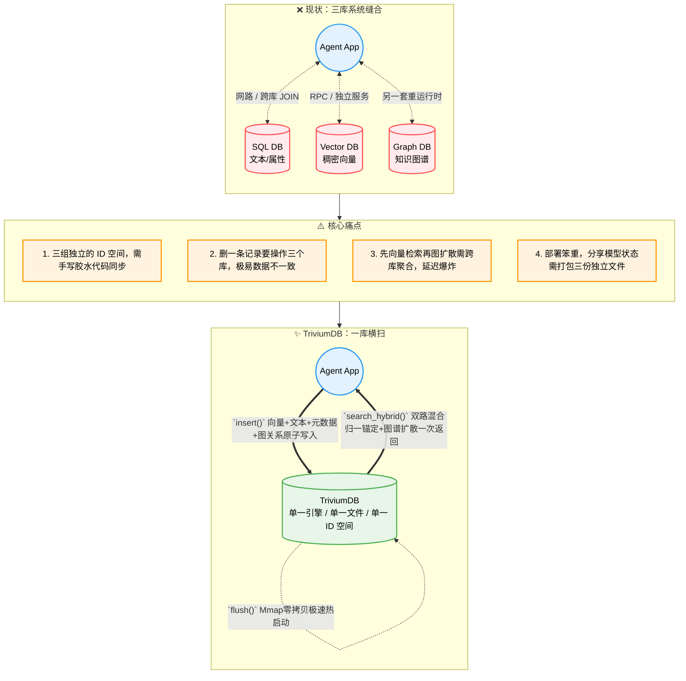

<br/><br/>

<div align="center">

<!-- 动态打字效果 Slogan -->
<a href="https://github.com/YoKONCy/TriviumDB">
  
</a>

<br/>

# TriviumDB

**向量 × 图谱 × 文档 —— 三位一体的 AI 原生嵌入式数据库**

**Battle-tested in mission-critical, air-gapped environments.**

> _Trivium_：拉丁语，意为"三条道路的交汇"。

> “_TriviumDB_ 定位是 AI 应用领域的嵌入式数据库，旨在解决单机环境下 Agent 复杂上下文和多模态记忆编织的痛点。如果是需要支撑千万并发的高可用分布式后端，请依然选择大型集群化组件！”

[](https://www.rust-lang.org/)
[](https://pypi.org/)
[](LICENSE)
[](https://arxiv.org/abs/2605.02171)

**中文** | [**English**](README_EN.md)

</div>

---

## 一句话介绍

TriviumDB 是一个用纯 Rust 编写的**嵌入式单文件数据库引擎**，将**向量检索（Vector）**、**属性图谱（Graph）**和**文档型元数据（Document）**原生融合在同一个存储内核中。

我们的目标是成为 **AI 应用领域的 SQLite**：

- 🧪 **自由 DIY 混合查询管线** —— TQL 把向量召回、属性索引、图扩展、图算法、路径、集合代数、迭代、聚合与重排变成可自由编排的算子，由确定性 Cascades 优化器统一规划
- 📊 **四类持久化属性索引** —— Hash / Ordered ART / Composite ART / Roaring Bitmap，等值、范围、前缀、复合条件与低基数集合运算全部索引加速
- 🧮 **内嵌图算法库** —— PageRank / WCC / Leiden / Betweenness / Degree / Label Propagation / SA-PPR 可在查询内直接调用，`ALL_PATHS` / `SHORTEST_PATHS` / `UNION` / `INTERSECT` / `EXCEPT` / `ITERATE` 一应俱全
- 🗃️ **Rom/Mmap 双引擎切换** —— 既支持单文件 `*.tdb` 复制走人，也支持分离 `.vec` 向量文件按需 mmap 零拷贝加载
- 🔗 **节点即一切** —— 每个节点天然同时拥有限定长度的稠密向量、稀疏文本倒排词频、元数据和图关系，ID 全局唯一，绝不错位
- 🧠 **为 AI 而生** —— 可选启用“AC自动机+BM25稀疏文本”与“Dense Vector稠密向量”的**多路召回**来触发图谱扩散检索，并内置多层认知管线（FISTA / DPP / PPR）
- 🛡️ **四层数据安全保障** —— 原子替换 + WAL日志 + 事务干跑验证（Dry-Run）+ Mmap COW 隔离，断电断存不毁库
- 🐍 **Python / Node.js 原生** —— `pip install` 或 `npm install` 后直接使用，类 MongoDB 查询语法
- ⚡ **高性能检索** —— rayon 并行暴力搜索（小规模 100% 精确）+ 自研 SOTA 级 ANN 索引 **QuIVer**（1 万节点以上自动激活），无需手动配置
- 💾 **SSD 友好** —— Append-Only WAL + 后台 Compaction 线程 + QuIVer 索引独立持久化，杜绝随机写入磨损
- 🔒 **共享只读打开** —— 多进程 Reader 共享锁并发查询已完成代际，Writer 继续保持排他锁与 WAL 安全边界
- 🧩 **类型化访问能力** —— Rust `DatabaseReader` 在编译期隐藏写 API，`DatabaseWriter` 保留完整嵌入式写能力
- 🔄 **不可变代际切换** —— `GenerationStore` 原子发布 current，跨进程 Reader 租约保护旧代安全回收，且不写入只读制品目录

---

<div align="center">

<!-- 动态分隔线 -->


<br/>

  
</div>

<br/>

## 为什么需要 TriviumDB？

### 当前 AI 应用的「三库割裂」困境

几乎所有的 AI 应用（Agent / RAG / 推荐系统）都同时需要三种数据能力，但市面上没有一个引擎能同时原生支持它们：



### 一个具体的例子

假设你在做一个 **AI 对话记忆系统**，用户说了一句「我昨天和小红去了咖啡馆」：

| 步骤         | 传统三库方案                 | TriviumDB                          |
| ------------ | ---------------------------- | ---------------------------------- |
| ① 存语义向量 | 调 Qdrant API 写入 embedding | `db.insert(vec, payload)` 一步完成 |
| ② 存数据     | 调 SQLite 写入时间、场景     | ↑ 同一步，payload 里就是 JSON      |
| ③ 存关系     | 调 Neo4j: 用户→地点→人物     | `db.link(user, cafe, "went_to")`   |
| ④ 后续召回   | 3 次跨库查询 + 手写合并      | `db.search(vec, expand_depth=2)`   |
| ⑤ 迁移数据   | 导出 3 份 + 写转换脚本       | 复制 `memory.tdb` 一个文件         |

### 适用场景

| 场景                     | 怎么用 TriviumDB                                                                                      |
| ------------------------ | ----------------------------------------------------------------------------------------------------- |
| 🤖 **AI Agent 长期记忆** | 每条对话存为节点（embedding + 原文 + 时间戳），人物/地点/事件之间建边，召回时先向量匹配再沿关系链扩散 |
| 🎮 **游戏 NPC 认知引擎** | NPC 观察到的事件存为带向量的节点，NPC 之间的关系用图谱表达，对话时检索相关记忆自动生成回应            |
| 📚 **个人知识库**        | Markdown 笔记切片后存入，概念之间手动或自动连边，语义搜索 + 知识图谱导航双模式浏览                    |
| 🔬 **小型推荐系统**      | 用户和物品各为节点，交互行为存为带权边，混合检索实现「相似用户喜欢的 + 你的社交圈在看的」             |
| 🧬 **生物信息学**        | 基因/蛋白质序列的 embedding + 互作关系网络，一库搜到相似序列并自动追溯代谢通路                        |

---

## 快速上手

### 安装

> 💡 TriviumDB 核心使用 Rust 编写，但我们已经在云端为您提前交叉编译了所有平台的二进制，**无需在本地安装任何编译环境即可秒速安装！**
>
> **Linux ARM64 / 鲲鹏支持：** TriviumDB 支持 Linux AArch64，包含 ARM NEON 优化、ARM64 CI、Python manylinux ARM64 wheel 和 Node.js ARM64 addon 构建链路，可运行于基于 Linux AArch64 的鲲鹏服务器系统。

### 🐍 Python 用户

推荐使用超快的 [uv](https://github.com/astral-sh/uv) （只需毫秒级）：

```bash
uv pip install triviumdb
```

或者使用传统 pip：

```bash
pip install triviumdb
```

### 🌐 Node.js / 前端用户

跨平台包已自带 `*.node` 预编译拓展，并含有完整的 TypeScript 补全：

```bash
npm install triviumdb
# 或者
pnpm add triviumdb
```

### 🦀 Rust 原生用户

直接把我们当成 Library 依赖：

```bash
cargo add triviumdb
```

### 30 秒入门

```python
import triviumdb

with triviumdb.TriviumDB("memory.tdb", dim=3) as db:
    id1 = db.insert([0.12, -0.45, 0.78], {"text": "小明喜欢吃苹果"})
    id2 = db.insert([0.08, -0.52, 0.81], {"text": "小红送了小明一箱苹果"})
    db.link(id1, id2, label="caused_by", weight=0.95)

    results = db.search([0.10, -0.48, 0.80], top_k=5, expand_depth=2, min_score=0.6)
    for hit in results:
        print(f"[{hit.id}] score={hit.score:.3f} | {hit.payload}")
```

批量 ANN 查询由 Rust 共享线程池并行执行；Python 整批释放 GIL，Node.js 返回 Promise 且不阻塞事件循环。同一路径只需打开一个数据库实例：

```python
batch_results = db.search_batch(
    [[0.10, -0.48, 0.80], [0.72, 0.11, -0.35]],
    top_k=10,
    parallelism=0,
)
```

```javascript
const batchResults = await db.searchBatch(queryVectors, 10, 0, 0.0)
```

`parallelism=0` 表示自动选择并发度，最大允许值为 64；结果外层顺序严格对应输入查询。批量 API 仅支持无状态查询，不允许 fatigue 语义。

> 📖 完整 API 参考、高级用法和 Rust 示例请查看 **[API 参考文档](docs/api-reference.md)**。

---

## 一次存储，多种查询

TriviumDB 中的一个节点可以同时拥有**向量、JSON 文档、稀疏文本和图关系**。这些数据共享同一个 NodeId、事务、WAL 与生命周期，因此无需在向量库、文档库和图库之间同步副本。同一份数据写入一次，即可按业务问题选择不同的查询路径。

### TQL：自由 DIY 的统一查询语言

**TQL（Trivium Query Language）** 不只是把三种查询语法拼在一起，而是一条**可自由编排的三模执行管线**：每个 `WITH` 阶段产出命名 NodeSet，向量、属性索引、图扩展、图算法、路径与集合代数都按你的业务语义自由串联，最后由 Cascades 优化器在预算内选择物理计划：

```sql
-- 文档查询：按 JSON 字段过滤（命中属性索引则跳过全表扫描）
FIND {type: "paper", year: {$gte: 2024}} RETURN * LIMIT 10

-- 图查询：匹配结构关系
MATCH (author)-[:wrote]->(paper)
WHERE author.name == "Alice"
RETURN paper

-- 向量锚定后，沿入边与出边做确定性结构扩展
SEARCH VECTOR [0.12, -0.45, 0.78] TOP 5
EXPAND BOTH [:cites|related*1..2]
RETURN *

-- GraphFirst：先由图模式限定合法候选，再在候选集内精确向量排名
MATCH (paper)-[:belongs_to]->(topic)
WHERE topic.name == "Database"
RANK paper BY VECTOR [0.12, -0.45, 0.78] TOP 10
RETURN paper

-- 🧪 自由 DIY：向量种子 → 图扩展 → 图算法打分 → 相似度过滤 → 重排
SEARCH VECTOR [0.12, -0.45, 0.78] TOP 100 AS seed
WITH seed
EXPAND seed [:cites*1..2] AS related
WITH related
pagerank related AS scored
WITH scored
WHERE similarity(scored) > 0.5
RETURN scored, similarity(scored) AS sim
ORDER BY sim DESC LIMIT 10

-- 🛰️ 路径查询：从语义锚点出发的有界最短路径
SEARCH VECTOR [1, 0] TOP 1 AS seed
WITH seed
SHORTEST_PATHS seed TO [42] LABEL cites AS route
WITH route
RETURN path(route) AS nodes, path_length(route) AS hops
```

一条查询内还能使用 `union` / `intersect` / `except` 做多路候选集合运算、`iterate` 做定点迭代扩散、`COUNT/SUM/AVG/MIN/MAX/COLLECT` 做聚合。`EXPLAIN` 会暴露 Cascades 选出的物理算子、预计行数、临时字节与预算切片。

```python
# Prepared TQL：同一管线安全地重复绑定业务参数
prepared = db.prepare_tql('FIND {kind: "note"} RETURN $bonus + 1 AS score')
print(prepared.parameter_names())          # ['bonus']
rows = db.execute_prepared_tql(prepared, {"bonus": 4})
```

Rust / Python / Node.js 三语言共享同一套 TQL、Prepared、四类属性索引与一等查询值。详细语法参见 **[TQL 查询语言参考](docs/tql-reference.md)**。

### 多种图谱与混合查询

| 查询方式 | 核心语义 | 典型用途 |
| -------- | -------- | -------- |
| **图模式匹配（MATCH）** | 按节点属性、边方向、label 和路径模式匹配结构 | 知识图谱查询、关系筛选、结构化联结 |
| **Reachability** | 按方向、label 和深度执行 BFS，返回确定性最短路径与逐跳 label | 依赖链、权限链、数据血缘、可达性分析 |
| **GraphFirst（MATCH + RANK）** | 先由图结构产生合法 anchor，再在候选集合内精确向量 Top-K | “只在某类关系约束内找最相似对象” |
| **向量 + 结构扩展（SEARCH + EXPAND）** | 先用向量定位语义锚点，再沿 `OUTGOING`、`INCOMING` 或 `BOTH` 收集结构候选 | 语义检索后补充上下游上下文 |
| **SA-PPR 图谱扩散** | 从向量/文本锚点沿带权边传播相关性能量，可启用抑制、疲劳和重启 | Agent 联想记忆、RAG 上下文扩展、推荐召回 |
| **混合检索（search_hybrid）** | AC 自动机 + BM25 稀疏文本 + Dense Vector 多路召回，再进行图扩散与重排 | 专有名词与语义兼顾的生产级检索 |
| **图算法管线（WITH + 算子）** | `pagerank` / `wcc` / `degree` / `leiden` / `label_propagation` / `sa_ppr` 对 NodeSet 打分，`graph_score()` 直接投影 | 影响力排序、社区发现、图谱分析 |
| **路径查询（ALL_PATHS / SHORTEST_PATHS）** | 有界全路径与批量最短路径，支持标签序列、避让节点与路径聚合 | 血缘追踪、依赖分析、权限链 |
| **集合代数（UNION / INTERSECT / EXCEPT）** | 多路候选 NodeSet 的确定性并 / 交 / 差 | 多路召回融合、候选收敛 |
| **Prepared TQL** | 参数化查询，缺参 / 多参 / 非法值一律 fail-closed | 高频业务查询的安全复用 |

这些能力不是互相替代的查询模式：**Reachability 回答“结构上能否到达”**，**GraphFirst 回答“结构约束内谁最相似”**，**SA-PPR 回答“哪些关联节点应获得更高相关性”**。应用可以在同一份 `.tdb` 数据上按场景自由选择，也可以通过 TQL 将文档、图和向量条件组合在一次查询中。

---

## 核心特性

| 特性                   | 说明                                                                                                                             |
| ---------------------- | -------------------------------------------------------------------------------------------------------------------------------- |
| 🧪 **自由 DIY 混合查询** | TQL `WITH` 管线：向量 / 属性 / 图扩展 / 图算法 / 路径 / 集合 / 迭代 / 聚合自由编排，确定性 Cascades 优化器 + `EXPLAIN` 成本透明 |
| 📊 **四类属性索引**    | Hash / Ordered ART / Composite ART / Roaring Bitmap，持久化 `.pidx`，等值 / 范围 / 前缀 / 复合 / 低基数集合运算全索引加速        |
| 🧮 **内嵌图算法库**    | PageRank / WCC / Leiden / Betweenness / Degree / Label Propagation / SA-PPR，在查询内直接调用                                    |
| 🛰️ **路径与集合代数**  | `ALL_PATHS` / `SHORTEST_PATHS` / `UNION` / `INTERSECT` / `EXCEPT` / `ITERATE`，Prepared TQL 三语言参数化                        |
| 🔍 **混合检索**        | 向量锚定 → Top-K → 图谱扩散（Spreading Activation）→ 最终排序                                                                    |
| 🧠 **认知管线**        | FISTA 残差寻隐 / SA-PPR 有限深度扩散 / DPP 多样性采样 / 疲劳不应期，运行时可独立开关                                         |
| 🔌 **Hook 扩展系统**   | 6 个管线关键阶段的自定义注入点：查询预处理 / 自定义召回 / 召回后处理 / 图扩散前 / 重排序 / 最终后处理，支持 C/C++ FFI 动态库插件 |
| 📦 **三位一体 O(1)**   | 自动增量 O(1) FreeList 墓碑空洞复用；删节点 O(1) 反向边哈希表（本项目称 Reverse Hash Net），彻底杜绝盘面膨胀与图谱雪崩           |
| ⚡ **QuIVer ANN 索引** | 自研 SOTA 级近似最近邻图索引：BQ 签名 + Vamana 图导航，冷热分离架构，增量 Insert/Delete/Update 无需重建                          |
| 💾 **双模式存储**      | Mmap（大模型极速分体冷启动） / Rom（传统 SQLite 级单文件打包携带），无缝热切换                                                   |
| 🛡️ **四层灾备防御**    | 预写日志(WAL) + 写入原子替换 + 事务预检干跑(Dry-Run) + OS 内存写时复制隔离                                                       |
| 🔄 **零开销事务**      | `begin_tx()` 验证前置架构，中途报错绝不污染内存，实现真正的零代价原子回滚；QuIVer 索引事务安全（分离时间线架构）                 |
| 🔎 **高级过滤**        | 类 MongoDB 语法：`$eq/$ne/$gt/$lt/$in/$and/$or` + 行级布隆特征阵列（Parallel Bit-Tag Array）硬件级加速                           |
| 📝 **图谱查询**        | 内置类 Cypher 查询引擎：`MATCH (a)-[:knows]->(b) WHERE b.age > 18 RETURN b`                                                      |
| 🐍 **Python 原生**     | PyO3 绑定，`pip install` 后直接 `import triviumdb`                                                                               |
| 🌐 **Node.js 原生**    | napi-rs 绑定，`npm install` 后直接 `require('triviumdb')`                                                                        |

> 📖 深入了解架构设计和技术细节请查看 **[支持特性详解](docs/features.md)**。

---

## 向量索引策略：QuIVer

**QuIVer**（**Qu**antized **I**ndexed **Ve**ctor **R**etrieval）是 TriviumDB 自研的 SOTA 级近似最近邻（ANN）图索引，融合 **BQ 二进制量化**与 **Vamana 图导航**，在保持极高召回率的同时实现数量级的检索加速。

> 📄 **学术论文**: [QuIVer: Rethinking ANN Graph Topology via Training-Free Binary Quantization](https://arxiv.org/abs/2605.02171)
>
> 🔬 **实验复现**: 完整的数据集准备、基准测试和复现指南请参阅 **[README_QUIVER.md](README_QUIVER.md)**
>
> 在 12 个百万级数据集（384-d 至 3072-d）上验证，QuIVer 以 \<1.3 GB 热内存实现 ≥88% Recall@10 @ 13-41K QPS，多线程吞吐量超 DiskANN Rust 2.5-3.3×、hnswlib 3.6-4.7×、FAISS HNSW 3.8-4.9×。

> ⚠️ **维度建议：强烈建议数据库向量维度不超过 3072。** TriviumDB 的通用存储与精确 BruteForce 检索允许更高维度，但 QuIVer 的 BQ 签名安全上限是 3072 维。超过该维度时引擎不会自动构建 QuIVer，检索会稳定回退到 BruteForce；手动构建 QuIVer 会返回明确错误。高维数据库仍可使用，但无法获得 QuIVer ANN 加速，内存和计算开销也会显著增加。

TriviumDB 采用**智能自适应双引擎**向量索引，全程自动路由，无需手动配置：

| 阶段           | 引擎       | 激活条件                         | 特点                                         |
| -------------- | ---------- | -------------------------------- | -------------------------------------------- |
| **小规模热区** | BruteForce | < 1 万节点（或 QuIVer 未就绪）   | 100% 精确召回，rayon 多核，延迟极低          |
| **大规模冷区** | **QuIVer** | 维度 ≤ 3072 且 ≥ 1 万节点时自动构建，独立持久化 | BQ 签名 + Vamana 图导航 + f32 精排，冷热分离 |

### QuIVer 的核心创新

**冷热分离架构**：QuIVer 内部仅存储 BQ 签名（hot）和图拓扑，f32 原始向量留在 MemTable 中（cold），精排时按需读取，**内存占用减半**。

> Mmap 消除的是全量载入和重复拷贝，并不会消除磁盘 I/O。冷向量页未驻留时仍会产生 Major Page Fault；当随机查询工作集超过物理内存时，吞吐和尾延迟取决于 PageCache 命中率、存储设备随机读能力及系统回收压力。QuIVer 热索引位于匿名堆内存，并非文件 PageCache；当前内存预算统计也不包含 OS PageCache。

**增量图维护**：与传统 HNSW 不同，QuIVer 支持真正的增量操作：

- ✅ **增量 Insert**：新节点实时插入图中，无需全量重建
- ✅ **增量 Delete**：Tombstone 软删除，25% 退化阈值触发重建
- ✅ **增量 Update**：soft_delete + incremental_insert，原子替换
- ✅ **事务安全**：分离时间线架构，事务 commit 不可失败，QuIVer 同步无需回滚

**独立持久化**：QuIVer 索引以 `.tdb.quiver` 独立文件存储，POD 数据 memcpy 极速序列化，重启后零开销恢复。

---

## 研究前线：TSNG 三信号导航

**TSNG（Tri-Signal Navigation Graph）** 是 TriviumDB 的混合检索研究线：在一个查询里同时声明**向量信号、属性信号与图信号**，用 `TsngWeights` 控制三路权重，得到统一打分的候选集——"既语义相似、又满足过滤条件、还在图结构上可达"。

```rust
use triviumdb::tsng::{TsngQuery, TsngWeights, GraphSignalQuery};

let query = TsngQuery {
    vector: &query_embedding,
    payload_filter: Some(&Filter::eq("kind", "note")),   // 属性信号
    graph: Some(GraphSignalQuery {                        // 图信号
        anchor_id: seed_id,
        direction: ReachabilityDirection::Outgoing,
        labels: Some(vec!["cites".into()]),
        min_edge_weight: 0.2,
        max_hops: 2,
    }),
    top_k: 10,
    weights: TsngWeights { vector: 1.0, property: 1.0, graph: 0.5 },
    budget: Default::default(),
};

let result = db.search_tsng(&query, config)?;   // 每个命中都带三路信号分解
```

研究价值在于**可度量的检索质量**：

- **多条执行策略**：`search_tsng_post_filter` / `search_tsng_graph_union` / `search_tsng_industrial`，六条混合搜索 AccessPath 按预算与统计选择
- **信号可解释**：`TsngHit` 返回 `vector_similarity` / `property_signal` / `graph_signal` 分解，不是黑盒分数
- **内置 Ground Truth**：`tsng_ground_truth` 生成精确答案，配套 Recall@K / NDCG@K 质量指标，论文级实验可直接复现
- **有界预算**：候选数、访问节点、扫描边与前沿大小四维预算全部 fail-closed

> ⚠️ TSNG 当前定位为**实验性研究轨道**（experimental research track）：生产默认路径仍是 TQL 与 `search*` 家族；TSNG API 可能随研究结论调整，不承诺语义冻结。

```toml
# 启用 Python 绑定
maturin develop --features python
```

---

## 项目结构

```
TriviumDB/
├── src/
│   ├── lib.rs              # 库入口 + 公开 API
│   ├── database/           # 数据库核心模块（v0.7.0 模块化重构）
│   │   ├── mod.rs          # Database 结构体、CRUD、生命周期管理
│   │   ├── config.rs       # StorageMode / Config / SearchConfig 配置
│   │   ├── pipeline.rs     # 混合检索管线（L0-L9 + 6 个 Hook 注入点）
│   │   └── transaction.rs  # 事务系统（TxOp / Transaction / WAL 回放 + QuIVer 分离时间线）
│   ├── hook.rs             # 🔌 Hook 扩展系统（SearchHook trait + FFI 动态库加载）
│   ├── cognitive.rs        # 认知算子（FISTA / DPP / NMF）
│   ├── node.rs             # Node / Edge / SearchHit 数据结构
│   ├── vector.rs           # VectorType Trait（f32 / f16 / u64）
│   ├── filter.rs           # 高级过滤引擎 ($gt/$lt/$in/$and/$or)
│   ├── tsng.rs             # 🔬 TSNG 三信号混合检索研究线（六条 AccessPath + Ground Truth）
│   ├── error.rs            # 统一错误类型（含 ApiMigrationRequired / Sidecar 版本门禁）
│   ├── query/              # 🧪 TQL 查询子系统（v0.8 查询引擎重构）
│   │   ├── tql_lexer.rs    #   词法分析（Token / 参数 / 位置诊断）
│   │   ├── tql_parser.rs   #   递归下降解析 + 作用域与语义校验
│   │   ├── tql_ast.rs      #   查询 / 管线 / 表达式 / 聚合 / Path AST
│   │   ├── cascades.rs     #   Cascades 优化器（Memo + 成本 + 预算切片）
│   │   ├── pipeline.rs     #   NodeSet 物理算子（图算法 / 路径 / 集合 / 迭代）
│   │   ├── tql_executor.rs #   一等值执行、聚合与结果投影
│   │   └── tql_prepared.rs #   Prepared TQL 严格参数绑定
│   ├── storage/
│   │   ├── memtable.rs     # 内存工作区 (SoA 向量池 + HashMap + QuIVer 集成)
│   │   ├── wal.rs          # Write-Ahead Log（崩溃恢复）
│   │   ├── file_format.rs  # .tdb 单文件读写（含 BQ Metadata + QuIVer 持久化）
│   │   ├── vec_pool.rs     # 分层向量池（mmap 基础层 + delta 增量层）
│   │   └── compaction.rs   # 后台 Compaction 守护线程（含 BQ 自动重建）
│   ├── index/
│   │   ├── brute_force.rs  # rayon 并行暴力精确搜索
│   │   ├── bq.rs           # BQ 二进制量化签名（QuIVer 基础层）
│   │   ├── quiver.rs       # 🚀 QuIVer ANN 索引（BQ + Vamana 图导航 + 冷热分离）
│   │   ├── property.rs     # 📊 四类属性索引（Hash / Ordered ART / Composite ART / Roaring Bitmap）
│   │   ├── text.rs         # 📝 TextIndex（Aho-Corasick + BM25 2-Gram 持久化）
│   │   └── graph_blocks.rs # 🔗 业务图块索引 .gidx（出边块 / 入边目录 / Label 目录）
│   ├── graph/
│   │   ├── traversal.rs    # SA-PPR 有限深度图扩散
│   │   ├── reachability.rs # 确定性可达性（方向 / 标签 / 深度 / 预算）
│   │   ├── pathfinding.rs  # 有界 ALL_PATHS / 批量最短路径
│   │   └── leiden.rs       # Leiden 社区发现算法
│   └── bindings/           # FFI 绑定层（公共逻辑已提取至核心模块）
│       ├── mod.rs          # 统一入口（feature-gated）
│       ├── python.rs       # PyO3 绑定（含 Hook 管理接口）
│       └── nodejs.rs       # napi-rs 绑定（含 Hook 管理接口）
├── cli/                    # 🖥️ CLI & TUI 工具（triviumdb-cli，命令 `tdb`）
│   ├── Cargo.toml
│   ├── README.md
│   └── src/
│       ├── main.rs             # clap 参数解析 + 模式分发
│       ├── db_handle.rs        # DbHandle dtype 动态分发（dispatch! 宏）
│       ├── formatter.rs        # table / json / csv 输出格式化
│       ├── tql_highlight.rs    # TQL 语法高亮（REPL ANSI + TUI Span）
│       ├── config.rs           # ~/.triviumdb.toml 配置加载
│       ├── commands/           # 非交互子命令（info/exec/export/import/repair/compact）
│       ├── repl/               # REPL 模式（rustyline + Tab 补全 + 多行输入）
│       └── tui/                # TUI 模式（ratatui + crossterm 全屏可视化）
├── benches/                # 性能基准套件（查询 / 索引与图基线 / 内存压力 / TSNG / Cohere1M）
├── tests/
│   ├── unit/               # 单元测试（集中管理，~311 用例）
│   ├── proptest_core.rs    # 属性测试（~2650 随机用例）
│   ├── proptest_query.rs   # TQL 解析器属性测试
│   ├── public_api_alignment.rs  # 三语言公共 API 对齐门禁
│   └── ...                 # 集成测试（并发/恢复/安全/压力/管线差分/图算法等）
├── docs/
│   ├── api-reference.md    # 完整 API 参考文档
│   ├── features.md         # 支持特性详解
│   ├── best-practices.md   # 最佳实践指南
│   ├── hook-guide.md       # Hook 开发指南（C++ FFI / Rust Hook）
│   ├── tql-reference.md    # TQL 查询语言参考
│   ├── testing.md          # 测试实践说明
│   └── security.md         # 安全设计说明
├── Cargo.toml
├── pyproject.toml          # Maturin 构建配置
└── README.md
```

---

## 路线图

### v0.1 — 核心引擎 MVP ✅

- [x] Node / Edge 数据结构 + 内存 MemTable + BruteForce 向量检索
- [x] 单文件 `.tdb` 序列化 + `insert` / `link` / `search` / `delete` API

### v0.2 — 持久化与生态 ✅

- [x] WAL 崩溃恢复 + 后台 Compaction + mmap 零拷贝
- [x] PyO3 Python 绑定 + rayon 并行扫描 + 高级 Payload 过滤

### v0.3 — 性能与跨平台 ✅

- [x] Node.js 绑定 (napi-rs)
- [x] AVX2 + FMA SIMD 加速余弦相似度

### v0.4 — 认知管线 + BQ 索引 ✅

- [x] Mmap / Rom 双引擎 + 验证前置事务 (Dry-Run)
- [x] 认知检索管线（FISTA / PPR / DPP）
- [x] BQ 二进制量化索引（自动激活 + 自动重建）

### v0.5 — 千万级架构 + Hook 系统 ✅

- [x] Parallel Bit-Tag Array 硬件级布隆过滤 + Zero-Ghost 墓碑复用
- [x] O(1) Reverse Hash Net 反向边查找
- [x] 检索管线 6 阶段 Hook 注入 + FFI 动态库插件
- [x] CI/CD 管线 + ASan + LibFuzzer 模糊测试

### v0.6 — TQL 查询语言 + 跨架构适配 ✅

- [x] TQL 统一查询语言（MATCH 图遍历 / FIND 文档过滤 / SEARCH 向量检索）
- [x] TQL DML 写操作（CREATE / SET / DELETE / DETACH DELETE）
- [x] 属性二级索引（O(1) 倒排查找 + TQL 自动加速）
- [x] ARM NEON SIMD 适配 + 跨平台 CI（Apple Silicon / Linux ARM64 via QEMU）
- [x] Python / Node.js 绑定 API 补全（tql_mut / create_index / get_payload 等）

### v0.7 — QuIVer SOTA ANN 索引 ✅

- [x] 自研 **QuIVer** 近似最近邻图索引（BQ 签名 + Vamana 图导航 + 冷热分离）
- [x] 增量图维护：Insert / Delete(Tombstone) / Update 全部增量，无需全量重建
- [x] QuIVer 独立持久化（`.tdb.quiver` 文件，POD memcpy 极速序列化）
- [x] 事务安全的分离时间线架构（Phase 5 QuIVer Sync）
- [x] CLI 工具 `triviumdb-cli`（命令 `tdb`）：非交互命令 + REPL（Tab 补全 / 语法高亮 / 多行输入）+ 配置文件
- [x] 数据库可视化工具：终端 TUI（`tdb ui`，图谱力导向布局 / k-hop 展开 / 向量搜索 Playground）

### v0.8 — 自由 DIY 混合查询时代 ✅ (当前，v0.8.3)

- [x] **四类持久化属性索引**：Hash / Ordered ART / Composite ART / Roaring Bitmap（`.pidx` v4，读取 v1–v4），等值、范围、前缀、复合与低基数集合运算全索引化
- [x] **TQL `WITH` 可组合管线**：命名 NodeSet、作用域校验、跨阶段自由编排，`FIND` / `MATCH` / `SEARCH` 均可进入管线
- [x] **Cascades 查询优化器**：确定性、有界、统计感知、成本驱动，Memo + 物理候选 + 预算切片，`EXPLAIN` 暴露物理算子 / 预计行数 / 临时字节
- [x] **内嵌图算法库**：PageRank / WCC / Degree / Betweenness / Leiden / Label Propagation / SA-PPR 查询内直调，`graph_score()` 一等投影
- [x] **路径与集合代数**：`ALL_PATHS`（标签序列 / 避让 / 路径聚合）、`SHORTEST_PATHS`、`UNION` / `INTERSECT` / `EXCEPT`、`ITERATE` 定点迭代
- [x] **表达式 / 聚合 / 空值**：`+ - * /`、`COALESCE`、`IS NULL`、`path()` / `path_length()`，`COUNT/SUM/AVG/MIN/MAX/COLLECT` 与 aggregate `DISTINCT`
- [x] **Prepared TQL 三语言同步**：严格参数绑定，缺参 / 多参 / 数组对象参数 / 非有限数值 fail-closed
- [x] **持久化 sidecar 索引体系**：`.pidx` / `.gidx`（业务图块+入边+Label 目录）/ `.text`（AC+BM25）/ `.quiver` 独立版本化，`storage_info()` / `index_info()` 诊断
- [x] **严格 API 迁移策略**：移除全部静默历史兼容，旧入口返回 `ApiMigrationRequired` 迁移错误与稳定错误码，无头 WAL 拒绝解析
- [x] **生产级硬保证**：ReadOnly / Immutable 字节级零写、四维查询预算 fail-closed、并行执行确定性、generation 原子发布
- [x] **TSNG 三信号研究线**：向量 / 属性 / 图统一打分、六条 AccessPath、exact ground truth 与 Recall@K / NDCG@K 评测

---

## 与现有方案对比

| 维度             | SQLite       | pgvector    | Kùzu        | Qdrant      | Neo4j       | SurrealDB    | LanceDB     | **TriviumDB**                   |
| ---------------- | ------------ | ----------- | ----------- | ----------- | ----------- | ------------ | ----------- | ------------------------------- |
| 并发多写模型     | ⚠️ 单写多读（WAL） | ✅ MVCC 多写 | ⚠️ 单进程单写 | ✅ 服务端并发写 | ✅ 并发事务写 | ✅ 分布式多写节点 | ✅ MVCC+OCC 并发写 | ⚠️ 单写多读 + 共享只读/不可换代际 |
| 文档型数据       | ✅ SQL       | ✅ SQL+JSONB | ⚠️ 需预定义表 Schema | ❌ 仅过滤 | ⚠️ 属性键值 | ✅ SurrealQL | ✅ Arrow Schema | ✅ 自由 JSON + `$op` 全家桶 |
| 向量检索         | ⚠️ 需外挂    | ✅ HNSW/IVFFlat | ✅ HNSW 扩展 | ✅ HNSW | ✅ 原生 HNSW | ✅ MTree/HNSW | ✅ IVF+量化 | ✅ 自研 QuIVer (BQ+Vamana) |
| 图谱遍历         | ⚠️ JOIN 模拟 | ⚠️ 递归 CTE | ✅ Cypher   | ❌ 无图原语 | ✅ Cypher   | ✅ 图查询    | ❌ 无图原语 | ✅ 原生邻接表 + `.gidx`         |
| 嵌入式单文件     | ✅ 单文件    | ❌ PG 服务  | ✅ 单文件    | ⚠️ 内存/目录嵌入式 | ❌ JVM 服务 | ✅ 可切换    | ⚠️ 目录嵌入式 | ✅ 单 .tdb          |
| 混合查询自由度   | ❌           | ⚠️ SQL JOIN 组合 | ⚠️ 过滤式向量搜索 | ❌ 单模向量 | ⚠️ SEARCH 过滤式 | ⚠️ 手动实现 | ⚠️ 向量+FTS+SQL | ✅ WITH 管线自由编排 |
| 属性索引体系     | ✅ B+Tree    | ✅ B/GIN/BRIN 全家桶 | ⚠️ 表 Schema 内索引 | ⚠️ Payload 索引 | ⚠️ Label+属性 Range/Text | ⚠️ Unique/全文/ANN 为主 | ⚠️ 标量索引 | ✅ Hash/ART/复合/Bitmap 四类 |
| 查询优化器       | ✅           | ✅          | ✅          | ❌ API 调用式 | ✅          | ⚠️ EXPLAIN 有限 | ⚠️ DataFusion SQL | ✅ Cascades + EXPLAIN           |
| 图算法库         | ❌           | ⚠️ 外部扩展  | ⚠️ algo 扩展 | ❌          | ⚠️ GDS 插件 | ❌           | ❌          | ✅ 7 种查询内直调               |
| 路径 / 集合查询  | ⚠️ 递归 CTE  | ⚠️ 递归 CTE | ✅ `*SHORTEST` + UNION | ❌ | ✅ shortestPath | ⚠️ 无路径原语 | ❌          | ✅ ALL/SHORTEST_PATHS + 集合    |
| 零外部依赖       | ✅           | ✅          | ✅          | ✅          | ❌ JVM      | ❌ RocksDB   | ⚠️ Arrow/对象存储生态 | ✅ 纯 Rust                      |

> **并发多写模型**是 TriviumDB 当前明确的短板：Writer 通过进程级排他文件锁独占写路径，多读并发依赖 ReadOnly 共享锁，跨进程无锁读依赖 Immutable 不可换代际。这与 SQLite（WAL 单写）和原版 Kùzu（单进程写）同为嵌入式架构的常见取舍；需要高并发多写的场景，应选择服务端（Qdrant/Neo4j/pgvector）或分布式（SurrealDB）/MVCC 表格式（LanceDB）方案。
>
> 对比基于各家 2026-08 公开文档与官方仓库：pgvector 为 PostgreSQL C 扩展（v0.8.2，HNSW/IVFFlat + 迭代扫描过滤）；Qdrant 支持嵌入式本地模式（`QdrantClient(":memory:")` 或 `path=`，存储为目录而非单文件），并有 Rust/Python 的 Qdrant Edge 嵌入库；LanceDB 为 Rust 内核嵌入式多模态 Lakehouse（向量+FTS+SQL，无图遍历）；Kùzu 主仓库已于 2025-10 归档（团队加入 Apple，0.11.3 为最终版本），其 Cypher 支持 `*SHORTEST` 递归路径与 algo 扩展；Neo4j 自 5.13 起提供原生向量索引（Lucene HNSW，Cypher 25 `SEARCH` 子句支持索引内过滤）；SurrealDB 向量索引用 MTree/HNSW；SQLite 可用 sqlite-vec 扩展与递归 CTE 模拟部分能力。**"混合查询自由度"** 指能否把向量、属性过滤、图遍历、图算法、路径与集合运算在同一查询中作为可编排算子交给统一优化器——这正是 TQL `WITH` 管线 + Cascades 的定位。

---

## 设计哲学

1. **三合一原子性**：一个 `u64` ID 同时映射到向量、Payload、边表。插入原子、删除原子，永不出现 ID 不一致。
2. **嵌入式优先**：没有 Server、没有端口、没有配置文件。`import triviumdb` 就是全部。
3. **全自动性能路由**：数据量不足 1 万时走 100% 精确 BruteForce，超过后引擎自动构建 QuIVer 索引并无缝切换，开发者无感知。
4. **可预测的性能**：顺序 I/O only（WAL 追加写 + Compaction 顺序重写），SSD 寿命安全。
5. **索引即加速层**：QuIVer 是可丢弃的派生数据（`.tdb.quiver` 独立文件），丢失后首次查询时自动重建，不依赖也不污染 WAL 真相源。
6. **Rust 安全边界**：所有公开 API 均为安全代码。内部仅存在少量经过严格审计的 `unsafe`（主要分布在 mmap 零拷贝与 SIMD 硬件加速），且附有明确的 SAFETY 安全契约注释。
7. **安全至上**：全引擎零 `panic!` / 零 `unreachable!()` 策略。数千个测试用例（单元 / 属性 / 模糊 / 变异 / 三语言公共 API 对齐），CI 强制 80% 行覆盖率门禁（实测值以 coverage artifact 为准），涵盖 EMI 比特翻转、WAL 截断恢复、事务预检失败等极端场景，确保在断网、断电、内存污染等恶劣条件下数据库引擎绝不崩溃。

---

## 📖 文档

| 文档                                          | 说明                                                   |
| --------------------------------------------- | ------------------------------------------------------ |
| **[API 完整参考](docs/api-reference.md)**     | 全部 Python / Node.js / Rust API、参数说明、返回值类型 |
| **[支持特性详解](docs/features.md)**          | 架构设计、存储引擎、索引策略、崩溃恢复等技术细节       |
| **[最佳实践](docs/best-practices.md)**        | 数据建模范式、性能调优、Hook 使用指南、避坑指南        |
| **[TQL 查询语言参考](docs/tql-reference.md)** | MATCH / FIND / SEARCH 语法、DML 写操作、属性索引       |
| **[Hook 开发指南](docs/hook-guide.md)**       | C/C++ FFI 插件编写、Rust Hook 实现、管线诊断实战       |
| **[测试实践](docs/testing.md)**               | 四层测试体系、属性测试、变异测试、覆盖率度量与 CI 建议 |
| **[安全设计说明](docs/security.md)**          | 并发安全、数据完整性、unsafe 审计、FFI 安全边界        |
| **[CLI 工具指南](cli/README.md)**             | `tdb` 命令行工具安装、用法、REPL/TUI 模式、配置文件   |

---

## 学术引用说明

TriviumDB 的认知检索管线借鉴并实现了以下学术成果（均为本项目基于原始论文的独立 Rust 实现，非调用第三方库）：

1. **FISTA** (Fast Iterative Shrinkage-Thresholding Algorithm)：Beck & Teboulle, 2009, _"A Fast Iterative Shrinkage-Thresholding Algorithm for Linear Inverse Problems"_, SIAM J. Imaging Sciences
2. **DPP** (Determinantal Point Process)：Kulesza & Taskar, 2012, _"Determinantal Point Processes for Machine Learning"_, Foundations and Trends in Machine Learning
3. **SA-PPR**（有限深度 Spreading Activation with Personalized Restart）：结合个性化重启思想与扩散激活；本实现不迭代至 PageRank 收敛
4. **Spreading Activation**：灵感来源于 Anderson, 1983, _"The Architecture of Cognition"_ 中的扩散激活理论
5. **BM25**：Robertson & Zaragoza, 2009, _"The Probabilistic Relevance Framework: BM25 and Beyond"_
6. **Vamana Graph**：Subramanya et al., 2019, _"DiskANN: Fast Accurate Billion-point Nearest Neighbor Search on a Single Node"_, NeurIPS 2019（QuIVer 的图导航层基于 Vamana 剪枝策略的独立 Rust 实现）
7. **Binary Quantization**：Gong et al., 2012, _"Iterative Quantization: A Procrustean Approach to Learning Binary Codes"_, CVPR（QuIVer 的 BQ 签名层基于符号位量化思想）

以下为本项目自研的数据结构与算法命名：

- **QuIVer**（Quantized Indexed Vector Retrieval）：自研 SOTA 级 ANN 图索引，融合 BQ 二进制量化与 Vamana 图导航，冷热分离架构
- **TSNG**（Tri-Signal Navigation Graph）：三信号（向量 / 属性 / 图）联合导航的混合检索研究线，提供多 AccessPath 执行策略与 exact ground truth 评测
- **Parallel Bit-Tag Array**（行级布隆特征阵列）：基于布隆过滤器思想的 JSON 快速过滤机制
- **Reverse Hash Net**（双向哈希边表）：O(1) 反向边查找的哈希索引结构
- **Zero-Ghost Node**：基于 FreeList 的墓碑复用策略，消除删除节点的幽灵引用
- **边特异性强化 / 不应期机制**：自研的图扩散能量调控策略
- **分离时间线架构**（Separated Timeline）：QuIVer 事务安全策略，利用 Infallible Apply 特性避免图索引回滚

### 📝 引用 QuIVer

如果您在研究中使用了 QuIVer 或 TriviumDB，请引用我们的论文：

```bibtex
@article{quiver2026,
  title   = {QuIVer: Rethinking ANN Graph Topology via Training-Free Binary Quantization},
  author  = {Xiao, Wenxuan and Wang, Zhiyou and Li, Chengcheng},
  journal = {arXiv preprint arXiv:2605.02171},
  year    = {2026},
  url     = {https://arxiv.org/abs/2605.02171}
}
```

---

## 许可证

Apache-2.0

**创造者**: [YoKONCy](https://github.com/YoKONCy)

---

## 社区

本项目已链接并认可 [LINUX DO 社区](https://linux.do/)。

<br/>

## 🌟 Star History

[](https://star-history.com/#YoKONCy/TriviumDB&Date)

<br/>

<div align="center">
  
</div>
