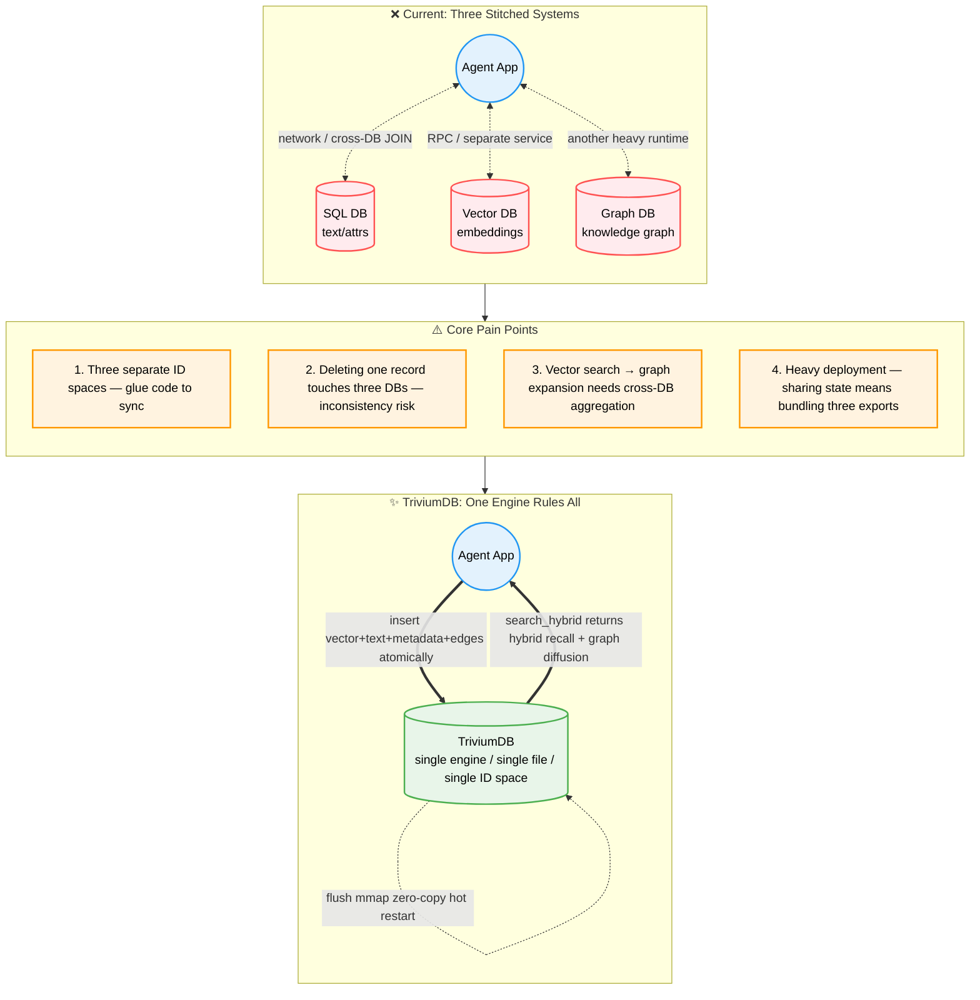

<br/><br/>

<div align="center">

<!-- Dynamic Typing Slogan -->
<a href="https://github.com/YoKONCy/TriviumDB">
  
</a>

<br/>

# TriviumDB

**Vector × Graph × Document — A Trinity AI-Native Embedded Database**

**Battle-tested in mission-critical, air-gapped environments.**

> _Trivium_: Latin for "the crossroads of three paths."

> "_TriviumDB_ is an embedded database for AI applications, designed to solve the pain points of complex context and multimodal memory weaving for Agents on a single machine. For high-availability distributed backends supporting tens of millions of concurrent connections, please use large-scale clustered components!"

[](https://www.rust-lang.org/)
[](https://pypi.org/)
[](LICENSE)
[](https://arxiv.org/abs/2605.02171)

[**中文文档**](README.md) | **English**

</div>

---

## What is TriviumDB?

TriviumDB is an **embedded single-file database engine** written in pure Rust, natively fusing **vector retrieval**, **property graph**, and **document-style metadata** within a single storage kernel.

Our goal: **SQLite for AI applications.**

- 🧪 **DIY hybrid query pipelines** — TQL turns vector recall, property indexes, graph expansion, graph algorithms, paths, set algebra, iteration, aggregation, and reranking into freely composable operators, planned by a deterministic Cascades optimizer
- 📊 **Four persistent property indexes** — Hash / Ordered ART / Composite ART / Roaring Bitmap: equality, range, prefix, composite predicates, and low-cardinality set operations all index-accelerated
- 🧮 **Built-in graph algorithm library** — PageRank / WCC / Leiden / Betweenness / Degree / Label Propagation / SA-PPR callable inside queries, plus `ALL_PATHS` / `SHORTEST_PATHS` / `UNION` / `INTERSECT` / `EXCEPT` / `ITERATE`
- 🗃️ **Dual storage modes** — Single-file `*.tdb` portability or split `.vec` mmap zero-copy loading
- 🔗 **Node = everything** — Each node natively holds a dense vector, sparse text index, JSON metadata, and graph edges under one globally unique ID
- 🧠 **AI-native** — Optional hybrid recall (AC-automaton BM25 + dense vector) triggers graph spreading activation, with built-in cognitive pipelines (FISTA / DPP / PPR)
- 🛡️ **4-layer data safety** — Atomic replacement + WAL + dry-run transaction validation + mmap COW isolation; `.flush_ok` v2 whole-file CRC makes corrupted inputs fail closed
- 🐍 **Python / Node.js native** — `pip install` or `npm install`, MongoDB-style query syntax
- ⚡ **High-performance search** — rayon parallel brute-force (100% exact at small scale) + in-house SOTA ANN index **QuIVer** (auto-activates above 10K nodes)
- 💾 **SSD-friendly** — Append-only WAL + background compaction + independent QuIVer persistence
- 🔒 **Shared read-only opens** — Multiple reader processes can query a completed generation under shared locks while writers retain exclusive WAL ownership
- 🧩 **Typed access capabilities** — Rust `DatabaseReader` hides mutation APIs at compile time while `DatabaseWriter` retains the complete embedded write surface
- 🔄 **Immutable generation switching** — `GenerationStore` atomically publishes current generations and uses cross-process runtime leases to protect safe reclamation without modifying read-only artifacts

---

<div align="center">

<!-- Animated separator -->


<br/>

  
</div>

<br/>

## Why TriviumDB?

### The "Three-Database Split" Problem

Almost every AI application (Agent / RAG / recommendation) needs three data capabilities simultaneously, yet no existing engine natively supports all three:



### A Concrete Example

Suppose you're building an **AI conversation memory system** and the user says "I went to a café with Alice yesterday":

| Step              | Traditional 3-DB approach         | TriviumDB                            |
| ----------------- | --------------------------------- | ------------------------------------ |
| ① Store embedding | Call Qdrant API to write vector   | `db.insert(vec, payload)` — one step |
| ② Store metadata  | Call SQLite to write time, scene  | ↑ Same step — payload is JSON        |
| ③ Store relations | Call Neo4j: user→café→person      | `db.link(user, cafe, "went_to")`     |
| ④ Recall later    | 3 cross-DB queries + manual merge | `db.search(vec, expand_depth=2)`     |
| ⑤ Migrate data    | Export 3 files + write scripts    | Copy `memory.tdb` — one file         |

### Use Cases

| Scenario                         | How to use TriviumDB                                                                                                                   |
| -------------------------------- | -------------------------------------------------------------------------------------------------------------------------------------- |
| 🤖 **AI Agent long-term memory** | Store each conversation as a node (embedding + text + timestamp), link people/places/events, recall via vector match + graph diffusion |
| 🎮 **Game NPC cognition**        | NPC observations become vector nodes, inter-NPC relationships form a graph, memory retrieval generates contextual dialogue             |
| 📚 **Personal knowledge base**   | Markdown notes chunked into nodes, concepts linked manually or auto-linked, semantic search + knowledge graph navigation               |
| 🔬 **Recommendation system**     | Users and items as nodes, interactions as weighted edges, hybrid retrieval for "similar users liked + your social circle is watching"  |
| 🧬 **Bioinformatics**            | Gene/protein sequence embeddings + interaction networks, find similar sequences and trace metabolic pathways in one query              |

---

## QuIVer: SOTA ANN Graph Index

**QuIVer** (**Qu**antized **I**ndex for **V**ector R**e**t**r**ieval) is TriviumDB's in-house ANN graph index, combining **2-bit Sign-Magnitude binary quantization** with **Vamana graph navigation** in a hot/cold memory separation architecture.

> 📄 **Paper**: [QuIVer: Rethinking ANN Graph Topology via Training-Free Binary Quantization](https://arxiv.org/abs/2605.02171)
>
> 🔬 **Reproducibility**: Full dataset preparation, benchmark scripts, and step-by-step reproduction guide: **[README_QUIVER.md](README_QUIVER.md)**
>
> Validated on 12 million-scale datasets (384-d to 3072-d): ≥88% Recall@10 at 13–41K multi-threaded QPS with <1.3 GB hot memory — outperforming DiskANN Rust by 2.5–3.3×, hnswlib by 3.6–4.7×, and FAISS HNSW by 3.8–4.9× in multi-threaded throughput at matched recall.

> ⚠️ **Dimension guidance: keeping database vectors at or below 3072 dimensions is strongly recommended.** TriviumDB storage and exact BruteForce retrieval support higher dimensions, but QuIVer's BQ signature safety limit is 3072 dimensions. Above this limit, automatic QuIVer construction is disabled and search safely falls back to BruteForce; manual QuIVer construction returns an explicit error. Higher-dimensional databases remain usable, but do not receive QuIVer ANN acceleration and incur substantially higher memory and compute costs.

TriviumDB uses an **intelligent auto-routing dual engine** for vector indexing — fully automatic, zero configuration:

| Phase                     | Engine     | Activation Condition                                | Characteristics                                                   |
| ------------------------- | ---------- | --------------------------------------------------- | ----------------------------------------------------------------- |
| **Small-scale hot zone**  | BruteForce | < 10K nodes (or QuIVer not ready)                   | 100% exact recall, rayon multi-core, ultra-low latency            |
| **Large-scale cold zone** | **QuIVer** | Auto-builds at ≥ 10K nodes when dimension ≤ 3072, independently persisted | BQ signatures + Vamana graph + f32 reranking, hot/cold separation |

### Key Innovations

**Hot/cold memory separation**: QuIVer internally stores only BQ signatures (hot) and graph topology; f32 raw vectors remain in MemTable (cold), accessed on-demand for reranking — **halving memory usage**.

> Mmap removes eager full loading and duplicate copies; it does not remove storage I/O. Non-resident cold-vector pages still cause major page faults. When a random-access working set exceeds physical memory, throughput and tail latency depend on page-cache hit rate, storage random-read capability, and reclaim pressure. QuIVer's hot index is anonymous heap memory rather than file page cache, and the configured memory budget does not include OS page cache.

**Incremental graph maintenance**: Unlike traditional HNSW, QuIVer supports true incremental operations:

- ✅ **Incremental Insert**: New nodes inserted into the graph in real-time, no full rebuild
- ✅ **Incremental Delete**: Tombstone soft-delete, 25% degradation threshold triggers rebuild
- ✅ **Incremental Update**: soft_delete + incremental_insert, atomic replacement
- ✅ **Transaction-safe**: Separated timeline architecture — transaction commit cannot fail, QuIVer sync needs no rollback

**Independent persistence**: QuIVer index stored as `.tdb.quiver` file, POD data memcpy ultra-fast serialization, zero-cost recovery on restart.

---

## Research Frontier: TSNG Tri-Signal Navigation

**TSNG (Tri-Signal Navigation Graph)** is TriviumDB's hybrid-retrieval research track: a single query declares **vector, property, and graph signals** together, with `TsngWeights` controlling the three-way mix, producing a unified scored candidate set — "semantically similar, filter-compliant, and structurally reachable".

```rust
use triviumdb::tsng::{TsngQuery, TsngWeights, GraphSignalQuery};

let query = TsngQuery {
    vector: &query_embedding,
    payload_filter: Some(&Filter::eq("kind", "note")),   // property signal
    graph: Some(GraphSignalQuery {                        // graph signal
        anchor_id: seed_id,
        direction: ReachabilityDirection::Outgoing,
        labels: Some(vec!["cites".into()]),
        min_edge_weight: 0.2,
        max_hops: 2,
    }),
    top_k: 10,
    weights: TsngWeights { vector: 1.0, property: 1.0, graph: 0.5 },
    budget: Default::default(),
};

let result = db.search_tsng(&query, config)?;   // every hit carries the signal breakdown
```

Its research value lies in **measurable retrieval quality**:

- **Multiple execution strategies**: `search_tsng_post_filter` / `search_tsng_graph_union` / `search_tsng_industrial` — six hybrid-search access paths selected by budget and statistics
- **Explainable signals**: `TsngHit` returns `vector_similarity` / `property_signal` / `graph_signal` decompositions, not a black-box score
- **Built-in ground truth**: `tsng_ground_truth` produces exact answers with Recall@K / NDCG@K quality metrics — paper-grade experiments are directly reproducible
- **Bounded budgets**: candidates, visited nodes, examined edges, and frontier size all fail closed

> ⚠️ TSNG is currently an **experimental research track**: the default production paths remain TQL and the `search*` family. The TSNG API may evolve with research findings and is not semantically frozen.

```toml
# Enable Python bindings
maturin develop --features python
```

---

## Quick Start

### Installation

> 💡 TriviumDB core is written in Rust, but we've pre-compiled binaries for all platforms in the cloud — **no local build toolchain needed, instant install!**
>
> **Linux ARM64 / Kunpeng support:** TriviumDB supports Linux AArch64 with ARM NEON optimizations, ARM64 CI, Python manylinux ARM64 wheels, and a Node.js ARM64 addon build pipeline. It can run on Kunpeng server operating systems based on Linux AArch64.

### 🐍 Python Users

Recommended: use the blazing-fast [uv](https://github.com/astral-sh/uv) (millisecond install):

```bash
uv pip install triviumdb
```

Or traditional pip:

```bash
pip install triviumdb
```

### 🌐 Node.js / Frontend Users

Cross-platform package includes pre-compiled `*.node` native extensions with full TypeScript completions:

```bash
npm install triviumdb
# or
pnpm add triviumdb
```

### 🦀 Rust Native Users

Use as a library dependency:

```bash
cargo add triviumdb
```

> 🧪 **Early Preview: HTTP Server Edition (nightly)** — TriviumDB's primary product form remains an **embedded database** (an in-process library, no deployment required). The optional `triviumdb-server` crate in this repository adds an HTTP shell (multi-client concurrent reads/writes, OCC, streaming NDJSON, etc.) and is currently in **nightly preview**: the protocol may change at any time, so it is for experimentation only — do not use it in production. See [Server Guide (nightly)](docs/server.md) (Chinese); all API and usage documentation remains authoritative for the embedded edition.

### 30-Second Demo

```python
import triviumdb

with triviumdb.TriviumDB("memory.tdb", dim=3) as db:
    id1 = db.insert([0.12, -0.45, 0.78], {"text": "Alice likes apples"})
    id2 = db.insert([0.08, -0.52, 0.81], {"text": "Bob gave Alice a box of apples"})
    db.link(id1, id2, label="caused_by", weight=0.95)

    results = db.search([0.10, -0.48, 0.80], top_k=5, expand_depth=2, min_score=0.6)
    for hit in results:
        print(f"[{hit.id}] score={hit.score:.3f} | {hit.payload}")
```

Batch ANN queries run concurrently on a shared Rust thread pool. Python releases the GIL for the entire batch, while Node.js returns a Promise without blocking the event loop. Only one database instance needs to open a path:

```python
batch_results = db.search_batch(
    [[0.10, -0.48, 0.80], [0.72, 0.11, -0.35]],
    top_k=10,
    parallelism=0,
)
```

```javascript
const batchResults = await db.searchBatch(queryVectors, 10, 0, 0.0)
```

`parallelism=0` selects concurrency automatically, with a maximum accepted value of 64. Outer result order always matches input query order. The batch API supports stateless queries only and rejects fatigue semantics.

> 📖 Full API reference, advanced usage, and Rust examples: **[API Reference](docs/api-reference.md)**

---

## Store Once, Query Many Ways

Every TriviumDB node can carry a **vector, JSON document, sparse text, and graph relationships** at the same time. They share one NodeId space, transaction boundary, WAL, and lifecycle, so applications do not need to synchronize copies across a vector database, document store, and graph database. Write the data once, then choose the query path that matches each question.

### TQL: A DIY-Composable Unified Query Language

**TQL (Trivium Query Language)** is not three syntaxes glued together — it is a **freely composable tri-modal execution pipeline**. Every `WITH` stage produces a named NodeSet; vectors, property indexes, graph expansion, graph algorithms, paths, and set algebra are chained according to your business semantics, and the Cascades optimizer picks the physical plan within budget:

```sql
-- Document query: filter JSON fields (property indexes skip full scans when hit)
FIND {type: "paper", year: {$gte: 2024}} RETURN * LIMIT 10

-- Graph query: match structural relationships
MATCH (author)-[:wrote]->(paper)
WHERE author.name == "Alice"
RETURN paper

-- Locate vector anchors, then deterministically expand over incoming and outgoing edges
SEARCH VECTOR [0.12, -0.45, 0.78] TOP 5
EXPAND BOTH [:cites|related*1..2]
RETURN *

-- GraphFirst: constrain candidates by graph structure, then rank exactly by vector
MATCH (paper)-[:belongs_to]->(topic)
WHERE topic.name == "Database"
RANK paper BY VECTOR [0.12, -0.45, 0.78] TOP 10
RETURN paper

-- 🧪 DIY: vector seed → graph expansion → graph algorithm scoring → similarity filter → rerank
SEARCH VECTOR [0.12, -0.45, 0.78] TOP 100 AS seed
WITH seed
EXPAND seed [:cites*1..2] AS related
WITH related
pagerank related AS scored
WITH scored
WHERE similarity(scored) > 0.5
RETURN scored, similarity(scored) AS sim
ORDER BY sim DESC LIMIT 10

-- 🛰️ Paths: bounded shortest paths from a semantic anchor
SEARCH VECTOR [1, 0] TOP 1 AS seed
WITH seed
SHORTEST_PATHS seed TO [42] LABEL cites AS route
WITH route
RETURN path(route) AS nodes, path_length(route) AS hops
```

A single query can also use `union` / `intersect` / `except` for multi-way candidate set algebra, `iterate` for fixed-point diffusion, and `COUNT/SUM/AVG/MIN/MAX/COLLECT` for aggregation. `EXPLAIN` exposes the physical operators chosen by Cascades, estimated rows, temp bytes, and budget slices.

```python
# Prepared TQL: safely rebind business parameters on the same pipeline
prepared = db.prepare_tql('FIND {kind: "note"} RETURN $bonus + 1 AS score')
print(prepared.parameter_names())          # ['bonus']
rows = db.execute_prepared_tql(prepared, {"bonus": 4})
```

Rust, Python, and Node.js share the same TQL, Prepared queries, four property indexes, and first-class query values. See the **[TQL Reference](docs/tql-reference.md)** for the complete syntax.

### Graph and Hybrid Query Modes

| Query Mode | Core Semantics | Typical Uses |
| ---------- | -------------- | ------------ |
| **Graph pattern matching (MATCH)** | Match structure by node properties, edge direction, labels, and path patterns | Knowledge graph queries, relationship filtering, structured joins |
| **Reachability** | Run direction-, label-, and depth-aware BFS and return deterministic shortest paths with per-hop labels | Dependency chains, authorization paths, lineage, reachability analysis |
| **GraphFirst (MATCH + RANK)** | Produce valid anchors from graph structure, then compute exact vector Top-K within that set | “Find the most similar objects only within this relationship constraint” |
| **Vector + structural expansion (SEARCH + EXPAND)** | Locate semantic anchors, then collect structural candidates through `OUTGOING`, `INCOMING`, or `BOTH` edges | Add upstream or downstream context after semantic retrieval |
| **SA-PPR graph diffusion** | Propagate relevance energy from vector/text anchors over weighted edges, with optional inhibition, fatigue, and restart | Agent associative memory, RAG context expansion, recommendation recall |
| **Hybrid retrieval (`search_hybrid`)** | Combine Aho-Corasick, BM25 sparse text, and dense vectors before graph diffusion and reranking | Production retrieval balancing exact terminology and semantic similarity |
| **Graph algorithm pipelines (WITH)** | `pagerank` / `wcc` / `degree` / `leiden` / `label_propagation` / `sa_ppr` score NodeSets; `graph_score()` projects results | Influence ranking, community detection, graph analytics |
| **Path queries (ALL_PATHS / SHORTEST_PATHS)** | Bounded all-paths and batch shortest paths with label sequences, forbidden nodes, and path aggregation | Lineage tracing, dependency analysis, authorization chains |
| **Set algebra (UNION / INTERSECT / EXCEPT)** | Deterministic union / intersection / difference over multi-way candidate NodeSets | Multi-way recall fusion, candidate convergence |
| **Prepared TQL** | Parameterized queries; missing / extra / invalid parameters fail closed | Safe reuse of high-frequency business queries |

These modes are complementary rather than interchangeable: **Reachability answers “is it structurally reachable?”**, **GraphFirst answers “which item is most similar within this structural constraint?”**, and **SA-PPR answers “which related nodes deserve more relevance?”** Applications can choose among them over the same `.tdb` data or combine document, graph, and vector conditions in one TQL query.

---

## Core Features

| Feature                          | Description                                                                                                                |
| -------------------------------- | -------------------------------------------------------------------------------------------------------------------------- |
| 🧪 **DIY hybrid queries**        | TQL `WITH` pipelines: vectors / properties / expansion / algorithms / paths / sets / iteration / aggregation freely composed, with deterministic Cascades optimization and transparent `EXPLAIN` |
| 📊 **Four property indexes**     | Hash / Ordered ART / Composite ART / Roaring Bitmap persisted to `.pidx`; equality / range / prefix / composite / low-cardinality set operations all accelerated |
| 🧮 **Built-in graph algorithms** | PageRank / WCC / Leiden / Betweenness / Degree / Label Propagation / SA-PPR callable inside queries                        |
| 🛰️ **Paths & set algebra**      | `ALL_PATHS` / `SHORTEST_PATHS` / `UNION` / `INTERSECT` / `EXCEPT` / `ITERATE`, plus Prepared TQL across three languages     |
| 🔍 **Hybrid retrieval**          | Vector anchor → Top-K → Graph spreading activation → Final ranking                                                         |
| 🧠 **Cognitive pipeline**        | Multi-layer cognitive retrieval: FISTA residual probing / PPR graph diffusion / DPP diversity sampling / refractory period |
| 🔌 **Hook system**               | 6-stage pipeline injection points with C/C++ FFI dynamic library plugin support                                            |
| 📦 **O(1) operations**           | FreeList tombstone reuse + Reverse Hash Net for O(1) reverse edge lookup                                                   |
| ⚡ **QuIVer ANN index**          | BQ signatures + Vamana graph navigation, hot/cold separation, incremental insert/delete/update                             |
| 💾 **Dual storage**              | Mmap (zero-copy cold start) / Rom (SQLite-style single-file portability)                                                   |
| 🛡️ **4-layer disaster recovery** | WAL + atomic replacement + dry-run validation + OS-level COW isolation                                                     |
| 🔄 **Zero-cost transactions**    | `begin_tx()` with pre-validation; errors never pollute memory state                                                        |
| 🔎 **Advanced filtering**        | MongoDB-style operators: `$eq/$ne/$gt/$lt/$in/$and/$or/$startsWith/$contains` + Parallel Bit-Tag Array                     |
| 📝 **Graph queries**             | Built-in Cypher-like query engine: `MATCH (a)-[:knows]->(b) WHERE b.age > 18 RETURN b`                                     |
| 🐍 **Python native**             | PyO3 bindings, `pip install` then `import triviumdb`                                                                       |
| 🌐 **Node.js native**            | napi-rs bindings, `npm install` then `require('triviumdb')`                                                                |

> 📖 Deep dive into architecture and technical details: **[Feature Details](docs/features.md)**

---

## Comparison with Existing Solutions

| Dimension            | SQLite       | pgvector      | Kùzu           | Qdrant           | Neo4j              | SurrealDB       | LanceDB        | **TriviumDB**                                   |
| -------------------- | ------------ | ------------- | -------------- | ---------------- | ------------------ | --------------- | -------------- | ----------------------------------------------- |
| Concurrent multi-writer | ⚠️ Single-writer (WAL) | ✅ MVCC multi-writer | ⚠️ Single-process writer | ✅ Server-side concurrent writes | ✅ Concurrent tx writes | ✅ Distributed write nodes | ✅ MVCC+OCC concurrent writes | ⚠️ Single-writer + shared-read/immutable generations |
| Document data        | ✅ SQL       | ✅ SQL+JSONB  | ⚠️ Fixed table schema | ❌ Filter only | ⚠️ Property KV    | ✅ SurrealQL    | ✅ Arrow schema | ✅ Free JSON + full `$op` suite                 |
| Vector search        | ⚠️ Extension | ✅ HNSW/IVFFlat | ✅ HNSW ext.  | ✅ HNSW          | ✅ Native HNSW     | ✅ MTree/HNSW   | ✅ IVF+quant    | ✅ QuIVer (BQ+Vamana)                           |
| Graph traversal      | ⚠️ JOIN      | ⚠️ Recursive CTE | ✅ Cypher    | ❌ No graph ops  | ✅ Cypher          | ✅ Graph        | ❌ No graph ops | ✅ Native adjacency + `.gidx`                   |
| Embedded single-file | ✅ One file  | ❌ PG server  | ✅ One file     | ⚠️ Memory/dir embedded | ❌ JVM        | ✅ Switchable   | ⚠️ Dir embedded | ✅ Single .tdb                                  |
| Hybrid query freedom | ❌           | ⚠️ SQL JOINs  | ⚠️ Filtered ANN | ❌ Vector-only  | ⚠️ SEARCH-filtered | ⚠️ Manual       | ⚠️ Vec+FTS+SQL | ✅ WITH pipeline composition                    |
| Property index suite | ✅ B+Tree    | ✅ B/GIN/BRIN | ⚠️ In-schema indexes | ⚠️ Payload indexes | ⚠️ Label+prop Range/Text | ⚠️ Unique/FTS/ANN-centric | ⚠️ Scalar idx | ✅ Hash / ART / Composite / Bitmap              |
| Query optimizer      | ✅           | ✅            | ✅              | ❌ API-call based | ✅                 | ⚠️ EXPLAIN limited | ⚠️ DataFusion SQL | ✅ Cascades + EXPLAIN                        |
| Graph algorithm library | ❌        | ⚠️ External ext. | ⚠️ algo extension | ❌            | ⚠️ GDS plugin      | ❌             | ❌             | ✅ 7 algorithms in-query                        |
| Path / set queries   | ⚠️ Recursive CTE | ⚠️ Recursive CTE | ✅ `*SHORTEST` + UNION | ❌ | ✅ shortestPath | ⚠️ No path primitives | ❌  | ✅ ALL/SHORTEST_PATHS + set algebra        |
| Zero dependencies    | ✅           | ✅            | ✅              | ✅               | ❌ JVM             | ❌ RocksDB      | ⚠️ Arrow/object-store ecosystem | ✅ Pure Rust                    |

> **Concurrent multi-writer** is TriviumDB's current known weakness: the Writer owns the write path through a process-level exclusive file lock, concurrent reads rely on ReadOnly shared locks, and lock-free cross-process reads rely on immutable published generations. This is a common trade-off among embedded engines — SQLite (single writer under WAL) and the original Kùzu (single-process writes) make the same choice. For workloads that genuinely need high-concurrency multi-writer access, prefer a server-based (Qdrant/Neo4j/pgvector), distributed (SurrealDB), or MVCC table-format (LanceDB) solution.
>
> Comparison verified against public docs and official repositories as of 2026-08: pgvector is a PostgreSQL C extension (v0.8.2, HNSW/IVFFlat with iterative-scan filtering); Qdrant offers an embedded local mode (`QdrantClient(":memory:")` or `path=`, stored as a directory rather than a single file) plus the Qdrant Edge embedded library for Rust/Python; LanceDB is a Rust-core embedded multimodal lakehouse (vector+FTS+SQL, no graph traversal); the main Kùzu repository was archived in Oct 2025 (the team joined Apple; 0.11.3 is the final release), and its Cypher supports `*SHORTEST` recursive paths plus the algo extension; Neo4j has shipped a native vector index since 5.13 (Lucene HNSW, with in-index filtering via the Cypher 25 `SEARCH` clause); SurrealDB vector indexes use MTree/HNSW; SQLite can emulate some capabilities via the sqlite-vec extension and recursive CTEs. **"Hybrid query freedom"** means being able to compose vectors, property filters, graph traversals, graph algorithms, paths, and set operations as pipeline operators handed to a unified optimizer within a single query — exactly what the TQL `WITH` pipeline + Cascades is built for.

---

## Project Structure

```
TriviumDB/
├── src/
│   ├── lib.rs              # Library entry + public API
│   ├── database/           # Core database module (v0.7.0 modular refactor)
│   │   ├── mod.rs          # Database struct, CRUD, lifecycle management
│   │   ├── config.rs       # StorageMode / Config / SearchConfig
│   │   ├── pipeline.rs     # Hybrid search pipeline (L0-L9 + 6 hook injection points)
│   │   └── transaction.rs  # Transaction system (TxOp / WAL replay + QuIVer separated timeline)
│   ├── hook.rs             # 🔌 Hook extension system (SearchHook trait + FFI dynamic library)
│   ├── cognitive.rs        # Cognitive operators (FISTA / DPP / NMF)
│   ├── node.rs             # Node / Edge / SearchHit data structures
│   ├── vector.rs           # VectorType Trait (f32 / f16 / u64)
│   ├── filter.rs           # Advanced filter engine ($gt/$lt/$in/$and/$or/$startsWith/$contains)
│   ├── tsng.rs             # 🔬 TSNG tri-signal hybrid retrieval research track (6 access paths + ground truth)
│   ├── error.rs            # Unified error types (incl. ApiMigrationRequired / sidecar version gates)
│   ├── query/              # 🧪 TQL query subsystem (v0.8 query engine refactor)
│   │   ├── tql_lexer.rs    #   Lexer (tokens / parameters / positional diagnostics)
│   │   ├── tql_parser.rs   #   Recursive-descent parser + scope & semantic validation
│   │   ├── tql_ast.rs      #   Query / pipeline / expression / aggregation / path AST
│   │   ├── cascades.rs     #   Cascades optimizer (memo + costing + budget slicing)
│   │   ├── pipeline.rs     #   NodeSet physical operators (algorithms / paths / sets / iteration)
│   │   ├── tql_executor.rs #   First-class value execution, aggregation & projection
│   │   └── tql_prepared.rs #   Prepared TQL strict parameter binding
│   ├── storage/
│   │   ├── memtable.rs     # In-memory workspace (SoA vector pool + HashMap + QuIVer integration)
│   │   ├── wal.rs          # Write-Ahead Log (crash recovery)
│   │   ├── file_format.rs  # .tdb single-file reader/writer (BQ metadata + QuIVer persistence)
│   │   ├── vec_pool.rs     # Layered vector pool (mmap base + delta incremental)
│   │   └── compaction.rs   # Background compaction daemon (with auto BQ rebuild)
│   ├── index/
│   │   ├── brute_force.rs  # rayon parallel exact search
│   │   ├── bq.rs           # BQ binary quantization signatures (QuIVer foundation)
│   │   ├── quiver.rs       # 🚀 QuIVer ANN index (BQ + Vamana graph + hot/cold separation)
│   │   ├── property.rs     # 📊 Four property indexes (Hash / Ordered ART / Composite ART / Roaring Bitmap)
│   │   ├── text.rs         # 📝 TextIndex (Aho-Corasick + BM25 2-Gram persistence)
│   │   └── graph_blocks.rs # 🔗 Business graph block index .gidx (edge blocks / in-edge / label directories)
│   ├── graph/
│   │   ├── traversal.rs    # PPR graph diffusion (Spreading Activation)
│   │   ├── reachability.rs # Deterministic reachability (direction / labels / depth / budget)
│   │   ├── pathfinding.rs  # Bounded ALL_PATHS / batch shortest paths
│   │   └── leiden.rs       # Leiden community detection
│   └── bindings/           # FFI binding layer
│       ├── mod.rs          # Unified entry (feature-gated)
│       ├── python.rs       # PyO3 bindings
│       └── nodejs.rs       # napi-rs bindings
├── crates/
│   ├── triviumdb-cli/      # 🖥️ CLI & TUI tool (command `tdb`)
│   │   ├── Cargo.toml
│   │   ├── README.md
│   │   └── src/
│   │       ├── main.rs             # clap argument parsing + mode dispatch
│   │       ├── db_handle.rs        # DbHandle dtype dynamic dispatch (dispatch! macro)
│   │       ├── formatter.rs        # table / json / csv output formatting
│   │       ├── tql_highlight.rs    # TQL syntax highlighting (REPL ANSI + TUI Span)
│   │       ├── config.rs           # ~/.triviumdb.toml configuration loading
│   │       ├── commands/           # Non-interactive subcommands (info/exec/export/import/repair/compact)
│   │       ├── repl/               # REPL mode (rustyline + Tab completion + multi-line input)
│   │       └── tui/                # TUI mode (ratatui + crossterm full-screen visualization)
│   └── triviumdb-server/   # 🌐 HTTP Server (concurrent reads, Writer Actor, OCC, Group Commit)
├── benches/                # Benchmark suites (queries / index & graph baselines / memory pressure / TSNG / Cohere1M)
├── tests/
│   ├── unit/               # Unit tests (~311 cases)
│   ├── proptest_core.rs    # Property-based tests (~2650 random cases)
│   ├── proptest_query.rs   # TQL parser property tests
│   ├── public_api_alignment.rs  # Three-language public API alignment gate
│   └── ...                 # Integration tests (concurrency/recovery/security/stress/pipeline differential/graph algorithms)
├── docs/
│   ├── api-reference.md    # Full API reference
│   ├── features.md         # Feature details
│   ├── best-practices.md   # Best practices guide
│   ├── hook-guide.md       # Hook development guide (C++ FFI / Rust Hook)
│   ├── tql-reference.md    # TQL query language reference
│   ├── testing.md          # Testing practices
│   └── security.md         # Security design notes
├── Cargo.toml
├── pyproject.toml          # Maturin build config
└── README.md
```

---

## Roadmap

### v0.1 — Core Engine MVP ✅

- [x] Node / Edge data structures + in-memory MemTable + BruteForce vector search
- [x] Single-file `.tdb` serialization + `insert` / `link` / `search` / `delete` API

### v0.2 — Persistence & Ecosystem ✅

- [x] WAL crash recovery + background compaction + mmap zero-copy
- [x] PyO3 Python bindings + rayon parallel scan + advanced payload filtering

### v0.3 — Performance & Cross-Platform ✅

- [x] Node.js bindings (napi-rs)
- [x] AVX2 + FMA SIMD accelerated cosine similarity

### v0.4 — Cognitive Pipeline + BQ Index ✅

- [x] Mmap / Rom dual engine + dry-run transaction validation
- [x] Cognitive retrieval pipeline (FISTA / PPR / DPP)
- [x] BQ binary quantization index (auto-activate + auto-rebuild)

### v0.5 — 10M-Scale Architecture + Hook System ✅

- [x] Parallel Bit-Tag Array hardware-accelerated bloom filtering + Zero-Ghost tombstone reuse
- [x] O(1) Reverse Hash Net reverse edge lookup
- [x] 6-stage pipeline hook injection + FFI dynamic library plugins
- [x] CI/CD pipeline + ASan + LibFuzzer

### v0.6 — TQL Query Language + Cross-Arch ✅

- [x] TQL unified query language (MATCH graph / FIND document / SEARCH vector)
- [x] TQL DML write operations (CREATE / SET / DELETE / DETACH DELETE)
- [x] Property secondary index (O(1) inverted lookup + TQL auto-acceleration)
- [x] ARM NEON SIMD adaptation + cross-platform CI (Apple Silicon / Linux ARM64)

### v0.7 — QuIVer SOTA ANN Index ✅

- [x] In-house **QuIVer** ANN graph index (BQ signatures + Vamana graph + hot/cold separation)
- [x] Incremental graph maintenance: Insert / Delete (Tombstone) / Update — no full rebuild
- [x] QuIVer independent persistence (`.tdb.quiver` file, POD memcpy serialization)
- [x] Transaction-safe separated timeline architecture (Phase 5 QuIVer Sync)
- [x] CLI tool `triviumdb-cli` (command `tdb`): non-interactive commands + REPL (Tab completion / syntax highlighting / multi-line input) + config file
- [x] Database visualization: terminal TUI (`tdb ui`, force-directed graph layout / k-hop expand / vector search playground)

### v0.8 — The DIY Hybrid Query Era ✅ (Current, v0.8.5)

- [x] **Four persistent property indexes**: Hash / Ordered ART / Composite ART / Roaring Bitmap (`.pidx` v4, reads v1–v4) — equality, range, prefix, composite, and low-cardinality set operations all indexed
- [x] **TQL `WITH` composable pipelines**: named NodeSets, scope validation, cross-stage composition; `FIND` / `MATCH` / `SEARCH` all enter the pipeline
- [x] **Cascades query optimizer**: deterministic, bounded, statistics-aware, cost-driven — memo + physical candidates + budget slicing; `EXPLAIN` exposes operators / estimated rows / temp bytes
- [x] **Built-in graph algorithm library**: PageRank / WCC / Degree / Betweenness / Leiden / Label Propagation / SA-PPR callable in-query with first-class `graph_score()` projection
- [x] **Paths & set algebra**: `ALL_PATHS` (label sequences / forbidden nodes / path aggregation), `SHORTEST_PATHS`, `UNION` / `INTERSECT` / `EXCEPT`, `ITERATE` fixed-point diffusion
- [x] **Expressions / aggregation / nulls**: `+ - * /`, `COALESCE`, `IS NULL`, `path()` / `path_length()`, `COUNT/SUM/AVG/MIN/MAX/COLLECT` with aggregate `DISTINCT`
- [x] **Prepared TQL across three languages**: strict parameter binding; missing / extra / array-or-object parameters / non-finite values fail closed
- [x] **Persistent sidecar index suite**: `.pidx` / `.gidx` (business graph blocks + in-edge + label directories) / `.text` (AC+BM25) / `.quiver` independently versioned, with `storage_info()` / `index_info()` diagnostics
- [x] **Strict API migration policy**: all silent legacy compatibility removed; legacy entry points return `ApiMigrationRequired` migration errors with stable error codes; headerless WAL rejected
- [x] **Production-grade hard guarantees**: ReadOnly / Immutable byte-level zero writes, four-dimensional query budgets failing closed, deterministic parallel execution, atomic generation publishing
- [x] **TSNG tri-signal research track**: vector / property / graph unified scoring, six access paths, exact ground truth with Recall@K / NDCG@K evaluation

### v0.8.4 Engineering Hardening ✅

- [x] **`.flush_ok` v2 integrity marker**: whole-file CRC32 over `.tdb`/`.vec` plus a self-checked marker; equal-length bit flips and sector tearing are now detectable. Corrupted inputs fail closed (ReadOnly/Immutable zero-write rejection; no more zero-vector pseudo-recovery), v1 markers remain bounded-compatible
- [x] **Zero panic on production paths**: `panic!/unreachable!` no longer reachable from external input, disk parsing, query execution, or bindings — structured errors plus a static guard
- [x] **Hooks across three languages + FFI ABI v2**: native six-stage hooks in Python / Node (structured error propagation; Node uses synchronous callbacks), FFI hooks upgraded to a v2 protocol with ABI version gating, error codes, and full six-stage injection
- [x] **Real fault-injection matrix**: child-process kill at publication phases (old complete generation or new complete generation — nothing else), deterministic I/O failpoints, fail-at-failpoint allocators, and an independent disk-format mutation suite (`tests/format_spec/`), all on small fixtures in isolated subprocesses that never exhaust real resources
- [x] **Cascades as the authoritative physical plan**: real Source/Filter/Expand/Rank candidates drive executor lowering, serializable physical properties, explicit `Complete/Fallback/BudgetExceeded` optimizer status surfaced via `EXPLAIN`
- [x] **Property-index numeric key encoding v2**: unified ordered keys for integers/floats (fixes composite range false-empty results), exact large-integer comparison with safe fallbacks, in-memory rebuild migration for legacy sidecars; fixes Ordered-index LIMIT truncating candidates before other predicates apply
- [x] **Community issue fixes**: #31 (parallel PageRank panic on out-of-subset edges) and #32 (hidden 5000-row TQL truncation)
- [x] **TQL SEARCH hot-path rework**: top-K partial selection + lazy materialization removes a ~6× regression; pipeline normalization no longer destroys similarity ranking

### v0.8.5 Query Experience & Server Preview ✅

- [x] **Prepared parameterized vectors**: `SEARCH VECTOR [$a, $b, ...]` per-dimension parameter placeholders with the same strict binding semantics as Prepared TQL, with zero impact on existing vector-literal performance
- [x] **Unified TQL value results**: `tql()` promoted to the unified first-class-value entry (nodes + scalar columns), with `tql_nodes()` for node-only results and `tql_values()` as a compatibility alias; legacy scalar RETURN support; Rust/Python/Node APIs kept in sync
- [x] **FIND/MATCH scan regression fixed** (Issue #36): `RoaringTreemap` active NodeId lazy iteration, LIMIT pushdown with streaming early-stop, bounded Hash posting reads, skip-refilter when the index covers a simple equality, and lazy start-candidate scans for edge-less MATCH — small unindexed LIMITs no longer materialize the whole table
- [x] **TriviumDB Server (nightly preview)**: `crates/triviumdb-server` HTTP shell — writer actor + bounded write queue + concurrent-read semaphore + writer-favored fairness gating, deadline / cancellation / idempotency keys, global / node / edge OCC (ETag / If-Match / 409 conflicts), multi-operation atomic transactions, core batched-WAL group commit with dynamic batching, prepared cache, NDJSON streaming, binary f32 vector transport, cooperative cancellation, per-request profile / EXPLAIN ANALYZE, index advice, structured logging (pretty/JSON) + request IDs + access logs + Prometheus metrics; cross-platform binary release pipeline (Linux x64/ARM64, Windows, macOS x64/ARM64)
- [x] **Repository layout**: CLI relocated to `crates/triviumdb-cli` alongside the server crate with isolated workspace publishing (the embedded core gains zero server dependencies)

---

## Design Philosophy

1. **Trinity atomicity** — One `u64` ID maps to vector, payload, and edge table simultaneously. Insert atomic, delete atomic, never inconsistent.
2. **Embedded-first** — No server, no port, no config file. `import triviumdb` is everything.
3. **Auto performance routing** — BruteForce below 10K nodes (100% exact), QuIVer auto-builds and seamlessly takes over above 10K.
4. **Predictable performance** — Sequential I/O only (WAL append + compaction sequential rewrite). SSD-safe.
5. **Index as acceleration layer** — QuIVer is disposable derived data (`.tdb.quiver` file); auto-rebuilds on first query if missing.
6. **Rust safety boundary** — All public APIs are safe code. Minimal audited `unsafe` only in mmap and SIMD paths.
7. **Zero-panic policy** — No `panic!` / `unreachable!()` in the engine. Thousands of test cases (unit / property / fuzz / mutation / three-language public API alignment), with an enforced 80% line-coverage CI gate (see coverage artifacts for measured values).

---

## 📖 Documentation

| Document                                     | Description                                                      |
| -------------------------------------------- | ---------------------------------------------------------------- |
| **[API Reference](docs/api-reference.md)**   | Full Python / Node.js / Rust API, parameters, return types       |
| **[Feature Details](docs/features.md)**      | Architecture, storage engine, indexing strategy, crash recovery  |
| **[Best Practices](docs/best-practices.md)** | Data modeling, performance tuning, Hook usage guide              |
| **[TQL Reference](docs/tql-reference.md)**   | MATCH / FIND / SEARCH syntax, DML operations, property index     |
| **[Hook Guide](docs/hook-guide.md)**         | C/C++ FFI plugin development, Rust Hook implementation           |
| **[Testing Practices](docs/testing.md)**     | 4-layer testing, property testing, mutation testing, coverage    |
| **[Security Design](docs/security.md)**      | Concurrency safety, data integrity, unsafe audit, FFI boundaries |
| **[CLI Tool Guide](crates/triviumdb-cli/README.md)** | `tdb` command-line tool installation, usage, REPL/TUI modes, config file |
| **[Server Guide (nightly)](docs/server.md)**  | HTTP server preview: concurrency model, OCC, idempotency, metrics & limits |

---

## Academic References

TriviumDB's cognitive retrieval pipeline implements the following academic works (all independent Rust implementations from original papers):

1. **FISTA**: Beck & Teboulle, 2009, _SIAM J. Imaging Sciences_
2. **DPP**: Kulesza & Taskar, 2012, _Foundations and Trends in ML_
3. **SA-PPR**: finite-depth Spreading Activation with Personalized Restart; it does not iterate to PageRank convergence
4. **Spreading Activation**: Anderson, 1983, _The Architecture of Cognition_
5. **BM25**: Robertson & Zaragoza, 2009
6. **Vamana Graph**: Subramanya et al., 2019, _DiskANN_, NeurIPS 2019
7. **Binary Quantization**: Gong et al., 2012, _Iterative Quantization_, CVPR

In-house data structures and algorithms:

- **QuIVer** — SOTA ANN graph index fusing BQ with Vamana graph navigation
- **TSNG** (Tri-Signal Navigation Graph) — tri-signal (vector / property / graph) hybrid retrieval research track with multiple access-path strategies and exact ground-truth evaluation
- **Parallel Bit-Tag Array** — Bloom-filter-inspired JSON fast filtering
- **Reverse Hash Net** — O(1) reverse edge lookup hash index
- **Zero-Ghost Node** — FreeList-based tombstone reuse
- **Separated Timeline Architecture** — QuIVer transaction safety via infallible apply

### 📝 Citing QuIVer

If you use QuIVer or TriviumDB in your research, please cite:

```bibtex
@article{quiver2026,
  title   = {QuIVer: Rethinking ANN Graph Topology via Training-Free Binary Quantization},
  author  = {Xiao, Wenxuan and Wang, Zhiyou and Li, Chengcheng},
  journal = {arXiv preprint arXiv:2605.02171},
  year    = {2026},
  url     = {https://arxiv.org/abs/2605.02171}
}
```

---

## License

Apache-2.0

**Creator**: [YoKONCy](https://github.com/YoKONCy)

---

## Community

This project is linked to and recognizes the [LINUX DO community](https://linux.do/).

<br/>

## 🌟 Star History

[](https://star-history.com/#YoKONCy/TriviumDB&Date)

<br/>

<div align="center">
  
</div>
