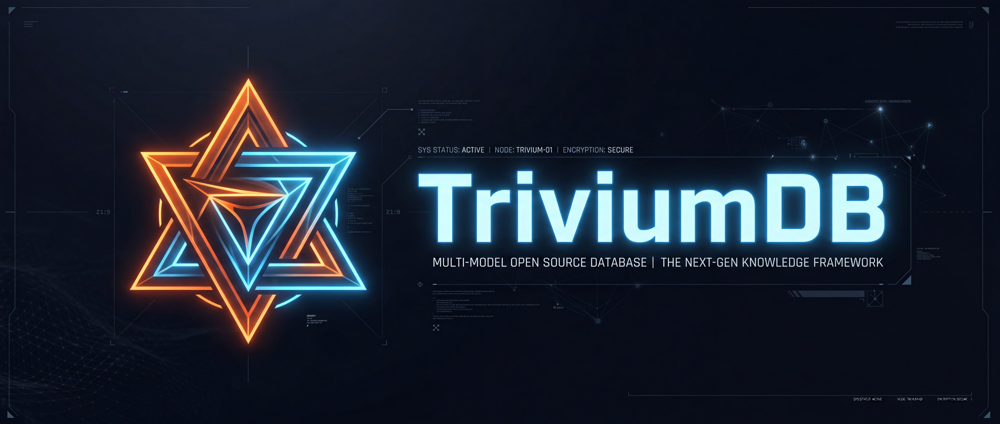
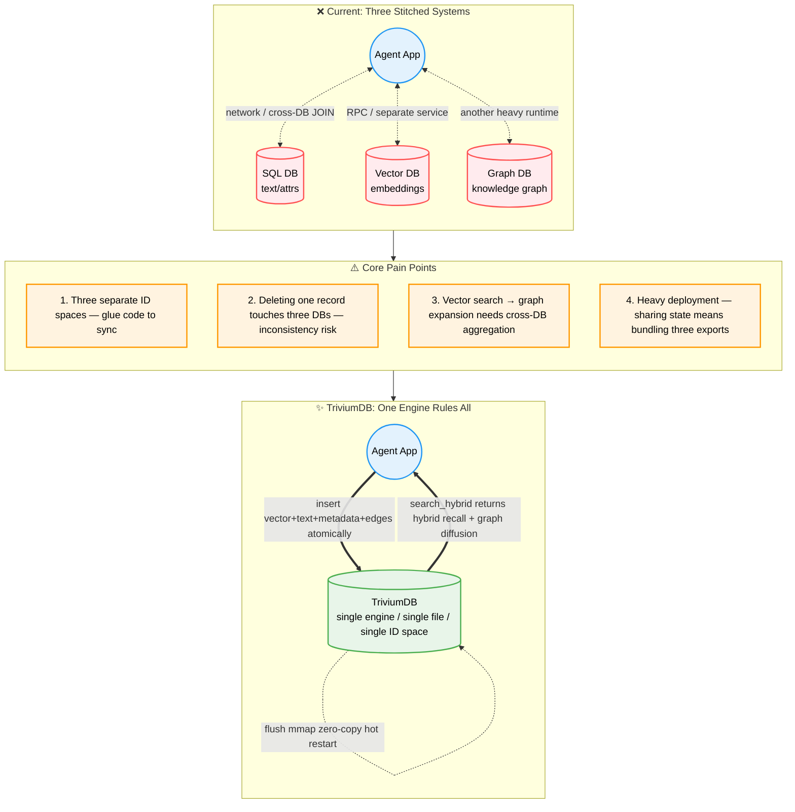

<br/><br/>

<div align="center">

<!-- Dynamic Typing Slogan -->
<a href="https://github.com/YoKONCy/TriviumDB">
  
</a>

<br/>

# TriviumDB

**Vector × Graph × Document — A Trinity AI-Native Embedded Database**

**Battle-tested in mission-critical, air-gapped environments.**

> _Trivium_: Latin for "the crossroads of three paths."

> "_TriviumDB_ is an embedded database for AI applications, designed to solve the pain points of complex context and multimodal memory weaving for Agents on a single machine. For high-availability distributed backends supporting tens of millions of concurrent connections, please use large-scale clustered components!"

[](https://www.rust-lang.org/)
[](https://pypi.org/)
[](LICENSE)
[](https://arxiv.org/abs/2605.02171)

[**中文文档**](README.md) | **English**

</div>

---

## What is TriviumDB?

TriviumDB is an **embedded single-file database engine** written in pure Rust, natively fusing **vector retrieval**, **property graph**, and **document-style metadata** within a single storage kernel.

Our goal: **SQLite for AI applications.**

- 🗃️ **Dual storage modes** — Single-file `*.tdb` portability or split `.vec` mmap zero-copy loading
- 🔗 **Node = everything** — Each node natively holds a dense vector, sparse text index, JSON metadata, and graph edges under one globally unique ID
- 🧠 **AI-native** — Optional hybrid recall (AC-automaton BM25 + dense vector) triggers graph spreading activation, with built-in cognitive pipelines (FISTA / DPP / PPR)
- 🛡️ **4-layer data safety** — Atomic replacement + WAL + dry-run transaction validation + mmap COW isolation
- 🐍 **Python / Node.js native** — `pip install` or `npm install`, MongoDB-style query syntax
- ⚡ **High-performance search** — rayon parallel brute-force (100% exact at small scale) + in-house SOTA ANN index **QuIVer** (auto-activates above 10K nodes)
- 💾 **SSD-friendly** — Append-only WAL + background compaction + independent QuIVer persistence
- 🔒 **Shared read-only opens** — Multiple reader processes can query a completed generation under shared locks while writers retain exclusive WAL ownership
- 🧩 **Typed access capabilities** — Rust `DatabaseReader` hides mutation APIs at compile time while `DatabaseWriter` retains the complete embedded write surface
- 🔄 **Immutable generation switching** — `GenerationStore` atomically publishes current generations and uses cross-process runtime leases to protect safe reclamation without modifying read-only artifacts

---

<div align="center">

<!-- Animated separator -->


<br/>

  
</div>

<br/>

## Why TriviumDB?

### The "Three-Database Split" Problem

Almost every AI application (Agent / RAG / recommendation) needs three data capabilities simultaneously, yet no existing engine natively supports all three:



### A Concrete Example

Suppose you're building an **AI conversation memory system** and the user says "I went to a café with Alice yesterday":

| Step              | Traditional 3-DB approach         | TriviumDB                            |
| ----------------- | --------------------------------- | ------------------------------------ |
| ① Store embedding | Call Qdrant API to write vector   | `db.insert(vec, payload)` — one step |
| ② Store metadata  | Call SQLite to write time, scene  | ↑ Same step — payload is JSON        |
| ③ Store relations | Call Neo4j: user→café→person      | `db.link(user, cafe, "went_to")`     |
| ④ Recall later    | 3 cross-DB queries + manual merge | `db.search(vec, expand_depth=2)`     |
| ⑤ Migrate data    | Export 3 files + write scripts    | Copy `memory.tdb` — one file         |

### Use Cases

| Scenario                         | How to use TriviumDB                                                                                                                   |
| -------------------------------- | -------------------------------------------------------------------------------------------------------------------------------------- |
| 🤖 **AI Agent long-term memory** | Store each conversation as a node (embedding + text + timestamp), link people/places/events, recall via vector match + graph diffusion |
| 🎮 **Game NPC cognition**        | NPC observations become vector nodes, inter-NPC relationships form a graph, memory retrieval generates contextual dialogue             |
| 📚 **Personal knowledge base**   | Markdown notes chunked into nodes, concepts linked manually or auto-linked, semantic search + knowledge graph navigation               |
| 🔬 **Recommendation system**     | Users and items as nodes, interactions as weighted edges, hybrid retrieval for "similar users liked + your social circle is watching"  |
| 🧬 **Bioinformatics**            | Gene/protein sequence embeddings + interaction networks, find similar sequences and trace metabolic pathways in one query              |

---

## QuIVer: SOTA ANN Graph Index

**QuIVer** (**Qu**antized **I**ndex for **V**ector R**e**t**r**ieval) is TriviumDB's in-house ANN graph index, combining **2-bit Sign-Magnitude binary quantization** with **Vamana graph navigation** in a hot/cold memory separation architecture.

> 📄 **Paper**: [QuIVer: Rethinking ANN Graph Topology via Training-Free Binary Quantization](https://arxiv.org/abs/2605.02171)
>
> 🔬 **Reproducibility**: Full dataset preparation, benchmark scripts, and step-by-step reproduction guide: **[README_QUIVER.md](README_QUIVER.md)**
>
> Validated on 12 million-scale datasets (384-d to 3072-d): ≥88% Recall@10 at 13–41K multi-threaded QPS with <1.3 GB hot memory — outperforming DiskANN Rust by 2.5–3.3×, hnswlib by 3.6–4.7×, and FAISS HNSW by 3.8–4.9× in multi-threaded throughput at matched recall.

> ⚠️ **Dimension guidance: keeping database vectors at or below 3072 dimensions is strongly recommended.** TriviumDB storage and exact BruteForce retrieval support higher dimensions, but QuIVer's BQ signature safety limit is 3072 dimensions. Above this limit, automatic QuIVer construction is disabled and search safely falls back to BruteForce; manual QuIVer construction returns an explicit error. Higher-dimensional databases remain usable, but do not receive QuIVer ANN acceleration and incur substantially higher memory and compute costs.

TriviumDB uses an **intelligent auto-routing dual engine** for vector indexing — fully automatic, zero configuration:

| Phase                     | Engine     | Activation Condition                                | Characteristics                                                   |
| ------------------------- | ---------- | --------------------------------------------------- | ----------------------------------------------------------------- |
| **Small-scale hot zone**  | BruteForce | < 10K nodes (or QuIVer not ready)                   | 100% exact recall, rayon multi-core, ultra-low latency            |
| **Large-scale cold zone** | **QuIVer** | Auto-builds at ≥ 10K nodes when dimension ≤ 3072, independently persisted | BQ signatures + Vamana graph + f32 reranking, hot/cold separation |

### Key Innovations

**Hot/cold memory separation**: QuIVer internally stores only BQ signatures (hot) and graph topology; f32 raw vectors remain in MemTable (cold), accessed on-demand for reranking — **halving memory usage**.

> Mmap removes eager full loading and duplicate copies; it does not remove storage I/O. Non-resident cold-vector pages still cause major page faults. When a random-access working set exceeds physical memory, throughput and tail latency depend on page-cache hit rate, storage random-read capability, and reclaim pressure. QuIVer's hot index is anonymous heap memory rather than file page cache, and the configured memory budget does not include OS page cache.

**Incremental graph maintenance**: Unlike traditional HNSW, QuIVer supports true incremental operations:

- ✅ **Incremental Insert**: New nodes inserted into the graph in real-time, no full rebuild
- ✅ **Incremental Delete**: Tombstone soft-delete, 25% degradation threshold triggers rebuild
- ✅ **Incremental Update**: soft_delete + incremental_insert, atomic replacement
- ✅ **Transaction-safe**: Separated timeline architecture — transaction commit cannot fail, QuIVer sync needs no rollback

**Independent persistence**: QuIVer index stored as `.tdb.quiver` file, POD data memcpy ultra-fast serialization, zero-cost recovery on restart.

```toml
# Enable Python bindings
maturin develop --features python
```

---

## Quick Start

### Installation

> 💡 TriviumDB core is written in Rust, but we've pre-compiled binaries for all platforms in the cloud — **no local build toolchain needed, instant install!**
>
> **Linux ARM64 / Kunpeng support:** TriviumDB supports Linux AArch64 with ARM NEON optimizations, ARM64 CI, Python manylinux ARM64 wheels, and a Node.js ARM64 addon build pipeline. It can run on Kunpeng server operating systems based on Linux AArch64.

### 🐍 Python Users

Recommended: use the blazing-fast [uv](https://github.com/astral-sh/uv) (millisecond install):

```bash
uv pip install triviumdb
```

Or traditional pip:

```bash
pip install triviumdb
```

### 🌐 Node.js / Frontend Users

Cross-platform package includes pre-compiled `*.node` native extensions with full TypeScript completions:

```bash
npm install triviumdb
# or
pnpm add triviumdb
```

### 🦀 Rust Native Users

Use as a library dependency:

```bash
cargo add triviumdb
```

### 30-Second Demo

```python
import triviumdb

with triviumdb.TriviumDB("memory.tdb", dim=3) as db:
    id1 = db.insert([0.12, -0.45, 0.78], {"text": "Alice likes apples"})
    id2 = db.insert([0.08, -0.52, 0.81], {"text": "Bob gave Alice a box of apples"})
    db.link(id1, id2, label="caused_by", weight=0.95)

    results = db.search([0.10, -0.48, 0.80], top_k=5, expand_depth=2, min_score=0.6)
    for hit in results:
        print(f"[{hit.id}] score={hit.score:.3f} | {hit.payload}")
```

Batch ANN queries run concurrently on a shared Rust thread pool. Python releases the GIL for the entire batch, while Node.js returns a Promise without blocking the event loop. Only one database instance needs to open a path:

```python
batch_results = db.search_batch(
    [[0.10, -0.48, 0.80], [0.72, 0.11, -0.35]],
    top_k=10,
    parallelism=0,
)
```

```javascript
const batchResults = await db.searchBatch(queryVectors, 10, 0, 0.0)
```

`parallelism=0` selects concurrency automatically, with a maximum accepted value of 64. Outer result order always matches input query order. The batch API supports stateless queries only and rejects fatigue semantics.

> 📖 Full API reference, advanced usage, and Rust examples: **[API Reference](docs/api-reference.md)**

---

## Store Once, Query Many Ways

Every TriviumDB node can carry a **vector, JSON document, sparse text, and graph relationships** at the same time. They share one NodeId space, transaction boundary, WAL, and lifecycle, so applications do not need to synchronize copies across a vector database, document store, and graph database. Write the data once, then choose the query path that matches each question.

### TQL: One Unified Query Language

**TQL (Trivium Query Language)** unifies document filtering, graph pattern matching, vector search, and GraphFirst constrained ranking in a lightweight DSL:

```sql
-- Document query: filter JSON fields
FIND {type: "paper", year: {$gte: 2024}} RETURN * LIMIT 10

-- Graph query: match structural relationships
MATCH (author)-[:wrote]->(paper)
WHERE author.name == "Alice"
RETURN paper

-- Locate vector anchors, then deterministically expand over incoming and outgoing edges
SEARCH VECTOR [0.12, -0.45, 0.78] TOP 5
EXPAND BOTH [:cites|related*1..2]
RETURN *

-- GraphFirst: constrain candidates by graph structure, then rank exactly by vector
MATCH (paper)-[:belongs_to]->(topic)
WHERE topic.name == "Database"
RANK paper BY VECTOR [0.12, -0.45, 0.78] TOP 10
RETURN paper
```

TQL also supports `WHERE`, `RETURN`, `ORDER BY`, `LIMIT/OFFSET`, aggregation, `OPTIONAL MATCH`, and DML. See the **[TQL Reference](docs/tql-reference.md)** for the complete syntax.

### Graph and Hybrid Query Modes

| Query Mode | Core Semantics | Typical Uses |
| ---------- | -------------- | ------------ |
| **Graph pattern matching (MATCH)** | Match structure by node properties, edge direction, labels, and path patterns | Knowledge graph queries, relationship filtering, structured joins |
| **Reachability** | Run direction-, label-, and depth-aware BFS and return deterministic shortest paths with per-hop labels | Dependency chains, authorization paths, lineage, reachability analysis |
| **GraphFirst (MATCH + RANK)** | Produce valid anchors from graph structure, then compute exact vector Top-K within that set | “Find the most similar objects only within this relationship constraint” |
| **Vector + structural expansion (SEARCH + EXPAND)** | Locate semantic anchors, then collect structural candidates through `OUTGOING`, `INCOMING`, or `BOTH` edges | Add upstream or downstream context after semantic retrieval |
| **SA-PPR graph diffusion** | Propagate relevance energy from vector/text anchors over weighted edges, with optional inhibition, fatigue, and restart | Agent associative memory, RAG context expansion, recommendation recall |
| **Hybrid retrieval (`search_hybrid`)** | Combine Aho-Corasick, BM25 sparse text, and dense vectors before graph diffusion and reranking | Production retrieval balancing exact terminology and semantic similarity |

These modes are complementary rather than interchangeable: **Reachability answers “is it structurally reachable?”**, **GraphFirst answers “which item is most similar within this structural constraint?”**, and **SA-PPR answers “which related nodes deserve more relevance?”** Applications can choose among them over the same `.tdb` data or combine document, graph, and vector conditions in one TQL query.

---

## Core Features

| Feature                          | Description                                                                                                                |
| -------------------------------- | -------------------------------------------------------------------------------------------------------------------------- |
| 🔍 **Hybrid retrieval**          | Vector anchor → Top-K → Graph spreading activation → Final ranking                                                         |
| 🧠 **Cognitive pipeline**        | Multi-layer cognitive retrieval: FISTA residual probing / PPR graph diffusion / DPP diversity sampling / refractory period |
| 🔌 **Hook system**               | 6-stage pipeline injection points with C/C++ FFI dynamic library plugin support                                            |
| 📦 **O(1) operations**           | FreeList tombstone reuse + Reverse Hash Net for O(1) reverse edge lookup                                                   |
| ⚡ **QuIVer ANN index**          | BQ signatures + Vamana graph navigation, hot/cold separation, incremental insert/delete/update                             |
| 💾 **Dual storage**              | Mmap (zero-copy cold start) / Rom (SQLite-style single-file portability)                                                   |
| 🛡️ **4-layer disaster recovery** | WAL + atomic replacement + dry-run validation + OS-level COW isolation                                                     |
| 🔄 **Zero-cost transactions**    | `begin_tx()` with pre-validation; errors never pollute memory state                                                        |
| 🔎 **Advanced filtering**        | MongoDB-style operators: `$eq/$ne/$gt/$lt/$in/$and/$or/$startsWith/$contains` + Parallel Bit-Tag Array                     |
| 📝 **Graph queries**             | Built-in Cypher-like query engine: `MATCH (a)-[:knows]->(b) WHERE b.age > 18 RETURN b`                                     |
| 🐍 **Python native**             | PyO3 bindings, `pip install` then `import triviumdb`                                                                       |
| 🌐 **Node.js native**            | napi-rs bindings, `npm install` then `require('triviumdb')`                                                                |

> 📖 Deep dive into architecture and technical details: **[Feature Details](docs/features.md)**

---

## Comparison with Existing Solutions

| Dimension            | SQLite       | Qdrant           | Neo4j              | SurrealDB       | **TriviumDB**                                   |
| -------------------- | ------------ | ---------------- | ------------------ | --------------- | ----------------------------------------------- |
| Document data        | ✅ SQL       | ❌ Filter only   | ⚠️ Properties      | ✅ SurrealQL    | ✅ JSON + $gt/$in                               |
| Vector search        | ⚠️ Extension | ✅ HNSW          | ❌ Plugin          | ✅ DiskANN      | ✅ QuIVer (BQ+Vamana)                           |
| Graph traversal      | ⚠️ JOIN      | ❌               | ✅ Cypher          | ✅ Graph        | ✅ Native adjacency                             |
| Embedded single-file | ✅           | ❌ Server        | ❌ JVM             | ✅ Switchable   | ✅ Single .tdb                                  |
| Hybrid search        | ❌           | ❌               | ❌                 | ⚠️ Manual       | ✅ Vector + graph diffusion                     |
| Zero dependencies    | ✅           | ✅               | ❌ JVM             | ❌ RocksDB      | ✅ Pure Rust                                    |
| Deletion cost        | ✅ O(1)      | ⚠️ Rebuild index | ⚠️ Reconnect edges | ⚠️ Tombstone GC | ✅ Incremental Tombstone, 25% threshold rebuild |

---

## Project Structure

```
TriviumDB/
├── src/
│   ├── lib.rs              # Library entry + public API
│   ├── database/           # Core database module (v0.7.0 modular refactor)
│   │   ├── mod.rs          # Database struct, CRUD, lifecycle management
│   │   ├── config.rs       # StorageMode / Config / SearchConfig
│   │   ├── pipeline.rs     # Hybrid search pipeline (L0-L9 + 6 hook injection points)
│   │   └── transaction.rs  # Transaction system (TxOp / WAL replay + QuIVer separated timeline)
│   ├── hook.rs             # 🔌 Hook extension system (SearchHook trait + FFI dynamic library)
│   ├── cognitive.rs        # Cognitive operators (FISTA / DPP / NMF)
│   ├── node.rs             # Node / Edge / SearchHit data structures
│   ├── vector.rs           # VectorType Trait (f32 / f16 / u64)
│   ├── filter.rs           # Advanced filter engine ($gt/$lt/$in/$and/$or/$startsWith/$contains)
│   ├── error.rs            # Unified error types
│   ├── storage/
│   │   ├── memtable.rs     # In-memory workspace (SoA vector pool + HashMap + QuIVer integration)
│   │   ├── wal.rs          # Write-Ahead Log (crash recovery)
│   │   ├── file_format.rs  # .tdb single-file reader/writer (BQ metadata + QuIVer persistence)
│   │   ├── vec_pool.rs     # Layered vector pool (mmap base + delta incremental)
│   │   └── compaction.rs   # Background compaction daemon (with auto BQ rebuild)
│   ├── index/
│   │   ├── brute_force.rs  # rayon parallel exact search
│   │   ├── bq.rs           # BQ binary quantization signatures (QuIVer foundation)
│   │   └── quiver.rs       # 🚀 QuIVer ANN index (BQ + Vamana graph + hot/cold separation)
│   ├── graph/
│   │   ├── traversal.rs    # PPR graph diffusion (Spreading Activation)
│   │   └── leiden.rs       # Leiden community detection
│   └── bindings/           # FFI binding layer
│       ├── mod.rs          # Unified entry (feature-gated)
│       ├── python.rs       # PyO3 bindings
│       └── nodejs.rs       # napi-rs bindings
├── cli/                    # 🖥️ CLI & TUI tool (triviumdb-cli, command `tdb`)
│   ├── Cargo.toml
│   ├── README.md
│   └── src/
│       ├── main.rs             # clap argument parsing + mode dispatch
│       ├── db_handle.rs        # DbHandle dtype dynamic dispatch (dispatch! macro)
│       ├── formatter.rs        # table / json / csv output formatting
│       ├── tql_highlight.rs    # TQL syntax highlighting (REPL ANSI + TUI Span)
│       ├── config.rs           # ~/.triviumdb.toml configuration loading
│       ├── commands/           # Non-interactive subcommands (info/exec/export/import/repair/compact)
│       ├── repl/               # REPL mode (rustyline + Tab completion + multi-line input)
│       └── tui/                # TUI mode (ratatui + crossterm full-screen visualization)
├── benches/
│   └── benchmark.rs        # Criterion performance benchmarks
├── tests/
│   ├── unit/               # Unit tests (~268 cases)
│   ├── proptest_core.rs    # Property-based tests (~2450 random cases)
│   ├── proptest_query.rs   # TQL fuzzing
│   └── ...                 # Integration tests (concurrency/recovery/stress)
├── docs/
│   ├── api-reference.md    # Full API reference
│   ├── features.md         # Feature details
│   ├── best-practices.md   # Best practices guide
│   ├── hook-guide.md       # Hook development guide (C++ FFI / Rust Hook)
│   ├── tql-reference.md    # TQL query language reference
│   ├── testing.md          # Testing practices
│   └── security.md         # Security design notes
├── Cargo.toml
├── pyproject.toml          # Maturin build config
└── README.md
```

---

## Roadmap

### v0.1 — Core Engine MVP ✅

- [x] Node / Edge data structures + in-memory MemTable + BruteForce vector search
- [x] Single-file `.tdb` serialization + `insert` / `link` / `search` / `delete` API

### v0.2 — Persistence & Ecosystem ✅

- [x] WAL crash recovery + background compaction + mmap zero-copy
- [x] PyO3 Python bindings + rayon parallel scan + advanced payload filtering

### v0.3 — Performance & Cross-Platform ✅

- [x] Node.js bindings (napi-rs)
- [x] AVX2 + FMA SIMD accelerated cosine similarity

### v0.4 — Cognitive Pipeline + BQ Index ✅

- [x] Mmap / Rom dual engine + dry-run transaction validation
- [x] Cognitive retrieval pipeline (FISTA / PPR / DPP)
- [x] BQ binary quantization index (auto-activate + auto-rebuild)

### v0.5 — 10M-Scale Architecture + Hook System ✅

- [x] Parallel Bit-Tag Array hardware-accelerated bloom filtering + Zero-Ghost tombstone reuse
- [x] O(1) Reverse Hash Net reverse edge lookup
- [x] 6-stage pipeline hook injection + FFI dynamic library plugins
- [x] CI/CD pipeline + ASan + LibFuzzer

### v0.6 — TQL Query Language + Cross-Arch ✅

- [x] TQL unified query language (MATCH graph / FIND document / SEARCH vector)
- [x] TQL DML write operations (CREATE / SET / DELETE / DETACH DELETE)
- [x] Property secondary index (O(1) inverted lookup + TQL auto-acceleration)
- [x] ARM NEON SIMD adaptation + cross-platform CI (Apple Silicon / Linux ARM64)

### v0.7 — QuIVer SOTA ANN Index ✅ (Current)

- [x] In-house **QuIVer** ANN graph index (BQ signatures + Vamana graph + hot/cold separation)
- [x] Incremental graph maintenance: Insert / Delete (Tombstone) / Update — no full rebuild
- [x] QuIVer independent persistence (`.tdb.quiver` file, POD memcpy serialization)
- [x] Transaction-safe separated timeline architecture (Phase 5 QuIVer Sync)
- [x] CLI tool `triviumdb-cli` (command `tdb`): non-interactive commands + REPL (Tab completion / syntax highlighting / multi-line input) + config file
- [x] Database visualization: terminal TUI (`tdb ui`, force-directed graph layout / k-hop expand / vector search playground)

---

## Design Philosophy

1. **Trinity atomicity** — One `u64` ID maps to vector, payload, and edge table simultaneously. Insert atomic, delete atomic, never inconsistent.
2. **Embedded-first** — No server, no port, no config file. `import triviumdb` is everything.
3. **Auto performance routing** — BruteForce below 10K nodes (100% exact), QuIVer auto-builds and seamlessly takes over above 10K.
4. **Predictable performance** — Sequential I/O only (WAL append + compaction sequential rewrite). SSD-safe.
5. **Index as acceleration layer** — QuIVer is disposable derived data (`.tdb.quiver` file); auto-rebuilds on first query if missing.
6. **Rust safety boundary** — All public APIs are safe code. Minimal audited `unsafe` only in mmap and SIMD paths.
7. **Zero-panic policy** — No `panic!` / `unreachable!()` in the engine. 3300+ test cases covering 94%+ code lines.

---

## 📖 Documentation

| Document                                     | Description                                                      |
| -------------------------------------------- | ---------------------------------------------------------------- |
| **[API Reference](docs/api-reference.md)**   | Full Python / Node.js / Rust API, parameters, return types       |
| **[Feature Details](docs/features.md)**      | Architecture, storage engine, indexing strategy, crash recovery  |
| **[Best Practices](docs/best-practices.md)** | Data modeling, performance tuning, Hook usage guide              |
| **[TQL Reference](docs/tql-reference.md)**   | MATCH / FIND / SEARCH syntax, DML operations, property index     |
| **[Hook Guide](docs/hook-guide.md)**         | C/C++ FFI plugin development, Rust Hook implementation           |
| **[Testing Practices](docs/testing.md)**     | 4-layer testing, property testing, mutation testing, coverage    |
| **[Security Design](docs/security.md)**      | Concurrency safety, data integrity, unsafe audit, FFI boundaries |
| **[CLI Tool Guide](cli/README.md)**           | `tdb` command-line tool installation, usage, REPL/TUI modes, config file |

---

## Academic References

TriviumDB's cognitive retrieval pipeline implements the following academic works (all independent Rust implementations from original papers):

1. **FISTA**: Beck & Teboulle, 2009, _SIAM J. Imaging Sciences_
2. **DPP**: Kulesza & Taskar, 2012, _Foundations and Trends in ML_
3. **SA-PPR**: finite-depth Spreading Activation with Personalized Restart; it does not iterate to PageRank convergence
4. **Spreading Activation**: Anderson, 1983, _The Architecture of Cognition_
5. **BM25**: Robertson & Zaragoza, 2009
6. **Vamana Graph**: Subramanya et al., 2019, _DiskANN_, NeurIPS 2019
7. **Binary Quantization**: Gong et al., 2012, _Iterative Quantization_, CVPR

In-house data structures and algorithms:

- **QuIVer** — SOTA ANN graph index fusing BQ with Vamana graph navigation
- **Parallel Bit-Tag Array** — Bloom-filter-inspired JSON fast filtering
- **Reverse Hash Net** — O(1) reverse edge lookup hash index
- **Zero-Ghost Node** — FreeList-based tombstone reuse
- **Separated Timeline Architecture** — QuIVer transaction safety via infallible apply

### 📝 Citing QuIVer

If you use QuIVer or TriviumDB in your research, please cite:

```bibtex
@article{quiver2026,
  title   = {QuIVer: Rethinking ANN Graph Topology via Training-Free Binary Quantization},
  author  = {Xiao, Wenxuan and Wang, Zhiyou and Li, Chengcheng},
  journal = {arXiv preprint arXiv:2605.02171},
  year    = {2026},
  url     = {https://arxiv.org/abs/2605.02171}
}
```

---

## License

Apache-2.0

**Creator**: [YoKONCy](https://github.com/YoKONCy)

---

## Community

This project is linked to and recognizes the [LINUX DO community](https://linux.do/).

<br/>

## 🌟 Star History

[](https://star-history.com/#YoKONCy/TriviumDB&Date)

<br/>

<div align="center">
  
</div>
