# TriviumDB 支持特性详解

> 深入剖析 TriviumDB 的架构设计、核心能力与技术实现细节。

---

## 目录

- [架构总览](#架构总览)
- [三位一体数据模型](#三位一体数据模型)
- [存储引擎](#存储引擎)
- [向量索引策略](#向量索引策略)
- [图谱扩散检索](#图谱扩散检索)
- [认知检索管线](#认知检索管线)
- [类 MongoDB 过滤引擎](#类-mongodb-过滤引擎)
- [类 Cypher 查询语言](#类-cypher-查询语言)
- [崩溃恢复机制](#崩溃恢复机制)
- [并发安全模型](#并发安全模型)
- [多语言绑定架构](#多语言绑定架构)

---

## 架构总览

TriviumDB 采用分层架构，各层职责明确：

```mermaid
flowchart TD
    classDef layer fill:#fafafa,stroke:#e0e0e0,stroke-width:2px,color:#333;
    classDef module fill:#e3f2fd,stroke:#2196f3,stroke-width:1px,color:#000;
    classDef math fill:#f3e5f5,stroke:#9c27b0,stroke-width:1px,color:#000;
    classDef storage fill:#e8f5e9,stroke:#4caf50,stroke-width:1px,color:#000;

    subgraph Layer1 ["🌐 用户 API 层"]
        direction LR
        API1[Python binding]:::module
        API2[Node.js binding]:::module
        API3[Rust pub API]:::module
    end
    Layer1:::layer

    subgraph Layer2 ["⚙️ 数据库核心层 (Database)"]
        direction LR
        C1[事务控制 Dry-Run]:::module
        C2[WAL 编排]:::module
        C3[内存预算 & Compaction调度]:::module
    end
    Layer2:::layer

    subgraph Layer3 ["🚀 引擎与执行层"]
        direction LR
        E1["向量索引\n(BruteForce / HNSW)"]:::module
        E2["图谱遍历\n(Spreading Activation)"]:::module
        E3["查询解析\n(Mongo Filter / Cypher)"]:::module
    end
    Layer3:::layer

    subgraph Layer4 ["🧠 认知管线层 (cognitive.rs)"]
        direction LR
        M1[FISTA 残差寻隐]:::math
        M2[DPP 多样性采样]:::math
        M3[NMF 语义矩阵分解]:::math
    end
    Layer4:::layer

    subgraph Layer5 ["🗂️ 内存工作区 (MemTable)"]
        direction LR
        M_VEC["SoA 向量池\n(基础层 mmap + 增量层 Vec)"]:::module
        M_PAY["HashMap\n(Payload 元数据)"]:::module
        M_EDGE["图谱邻接表\n(Edges 边集)"]:::module
    end
    Layer5:::layer

    subgraph Layer6 ["💾 持久化层 (Storage)"]
        direction LR
        S1[".tdb 聚合数据 / 元数据"]:::storage
        S2[".vec 分离 mmap 向量文件"]:::storage
        S3["WAL 追加顺序日志"]:::storage
    end
    Layer6:::layer

    Layer1 ---> Layer2
    Layer2 ---> Layer3
    Layer3 ---> Layer4
    Layer4 ---> Layer5
    Layer5 ---> Layer6
```



---

## 三位一体数据模型

每个节点在内部同时持有三种数据，共享全局唯一的 `u64` 主键：

| 数据层 | 存储位置 | 内容 | 用途 |
|--------|----------|------|------|
| **向量层** (Vector) | 连续 `Vec<T>` 数组 (SoA) | `f32 × dim` 浮点数组 | 语义相似度检索 (稠密召回) |
| **稀疏层** (Sparse Text)| 内存倒排 / AC自动机 | BM25 词频统计 / 匹配树表 | 精确词汇与长文本全文检索 |
| **元数据层** (Payload) | `HashMap<u64, JSON>` | 任意 JSON Key-Value | 条件过滤、业务数据 |
| **图谱层** (Graph) | `HashMap<u64, Vec<Edge>>` | 有向带权边邻接表 | 关系遍历、扩散激活 |

### 为什么选择 SoA 而不是 AoS？

**AoS (Array of Structures)**：每个节点的 `{vector, payload, edges}` 紧挨存放。
- ❌ 向量检索时 CPU 缓存被无用的 payload 数据污染
- ❌ 无法对向量数组做 SIMD 批量计算

**SoA (Structure of Arrays)**：所有向量连续存入一个大数组，payload 和 edges 各自独立存储。
- ✅ 向量检索时 CPU L1/L2 缓存命中率极高
- ✅ rayon 并行 + SIMD 友好
- ✅ mmap 映射时可直接 OS 层分页 zero-copy 加载向量块

---

## 存储引擎与双模式切换

TriviumDB 提供两种互斥的存储模式（`StorageMode`），且**系统支持无缝热切换**（只需在打开数据库时更改配置，下一次 `flush()` 时会自动重组转换结构）：

### 1. Rom 模式（便携单文件优先）

所有数据（向量 + Payload + 边）都被打包进一个致密的 `.tdb` 二进制文件中，启动时**全量装载进内存**。
对于几十万节点规模的知识库，它是最理想的格式，只需拷贝一个 `.tdb` 即可完成库的转移，类似 SQLite。

### 2. Mmap 模式（大规模零拷贝优先，默认）

启动时，所有大体积的持续增长向量池（Vector Block）将分离为独立的 `.vec` 文件，而 `.tdb` 中只记录关系边和 Payload。
- **MAP_PRIVATE (COW)**：通过 `memmap2` 库将数GB的向量文件映射到操作系统的虚拟内存中。进程不会真的霸占物理内存，而是由 OS 根据查询压力按需（Page Fault）换入换出。
- 对增量写入极度友好，所有的修改（插入/更新）只发生在进程的增量内存（Delta Allocation）和写时复制的私有页中，不破坏底层物理 `.vec` 文件，直到成功触发 `flush` 发生原子打包分离。

### 单个 .tdb 底层布局 (Rom模式 / Mmap时的元数据底座)

所有数据打包进一个 `.tdb` 二进制文件，内部由四个连续的块组成：

```
┌────────────────────────┐ offset 0
│       File Header       │ 50 字节
│  MAGIC + VERSION + dim  │
│  next_id + node_count   │
│  各 block 的 offset     │
├────────────────────────┤ payload_offset
│     Payload Block       │ [node_id(8B) + json_len(4B) + json_data] × N
├────────────────────────┤ vector_offset
│      Vector Block       │ 连续 f32 数组（可 mmap 零拷贝加载）
├────────────────────────┤ edge_offset
│       Edge Block        │ [src(8B) + dst(8B) + label_len(2B) + label + weight(4B)] × M
└────────────────────────┘
```

### 安全写入流程

```
内存数据 → 写入 .tdb.tmp → fsync 落盘 → 原子 rename 替换 .tdb → 清除 WAL
```

不管无论在哪一步崩溃，都不会损坏已有数据：
- 步骤 1-2 崩溃：`.tmp` 残留但旧 `.tdb`/`.vec` 完好 → 重启用旧数据 + WAL 回放
- 步骤 3 崩溃：新文件已就绪 + WAL 仍在 → 重启回放幂等数据（安全冗余）
- 全部完成：清理 WAL，变成极致的干净状态

### Write-Ahead Log (WAL)

所有写操作（insert / delete / link / unlink / update）在生效前先追加写入 WAL 文件。

- **Append-Only**：仅顺序追加，绝不随机写入，SSD 友好
- **CRC32 校验**：每条记录都附带 CRC32，回放时自动跳过损坏条目
- **三种同步模式**：Full（fsync）/ Normal（flush）/ Off（无）

---

## 向量索引策略

通过 Cargo Features 在编译期选择索引后端：

### BruteForce（默认）

- **精确度**：100% 精确召回，零误差
- **并行化**：rayon `par_chunks` 多核线性加速
- **原理**：对整个 SoA 向量池做并行余弦相似度扫描
- **适用规模**：< 10 万节点

```rust
// 内部实现伪码
flat_vectors
    .par_chunks(dim)                    // rayon 并行切块
    .enumerate()
    .map(|(idx, vec)| cosine_sim(query, vec))
    .top_k(k)                          // 取最高分前 K 个
```

### HNSW（可选，Feature-gated）

- **精确度**：近似搜索，可能遗漏少量结果
- **时间复杂度**：O(log N)，亚毫秒级响应
- **适用规模**：10 万 ~ 千万节点
- **启用方式**：`cargo build --features hnsw`

```toml
# Cargo.toml
[features]
hnsw = ["dep:instant-distance"]
```

| 对比 | BruteForce | HNSW |
|------|-----------|------|
| 召回率 | 100% | ~95%+ |
| 延迟 | 随节点数线性增长 | 亚毫秒级稳定 |
| 内存开销 | 仅原始向量 | 额外图索引结构 |
| 动态插入 | 零开销 | 需维护图结构 |

---

## 图谱扩散检索

TriviumDB 的核心创新——**Spreading Activation（扩散激活）**：

### 工作流程

1. **双路锚定 (Hybrid Recall)**：融合 `Aho-Corasick 定点词汇匹配` + `BM25 倒排相似度` + `Dense Vector 稠密余弦分数`，按 `alpha` 权重混合打分，找出最精确的初始锚点，有效解决传统纯向量 RAG 容易在专有名词上“瞎联想”的幻觉缺陷。
2. **图谱扩散**：从双路召回的锚点池出发，沿邻接表进行 N 跳广度优先遍历
3. **热度传播**：锚点的相似度得分按边权重衰减传播给邻居节点
4. **去重排序**：合并锚点和扩散节点，按最终得分排序返回

### 扩散深度与行为

| `expand_depth` | 行为 |
|----------------|------|
| `0` | 纯向量检索，不进行图谱扩散 |
| `1` | 返回锚点 + 锚点的直接邻居 |
| `2` | 返回锚点 + 1 跳邻居 + 2 跳邻居 |
| `N` | 返回 N 跳以内的所有关联节点 |

### 典型应用场景

```python
# AI Agent 记忆系统：用户说了"咖啡"
# 1. 向量检索找到最相似的记忆"昨天去了星巴克"
# 2. 沿图谱扩散，发现关联的人物"小红"和地点"三里屯"
results = db.search(
    query_vector=encode("咖啡"),
    top_k=3,
    expand_depth=2,  # 关键！扩散 2 跳
    min_score=0.4
)
# 结果：["昨天去了星巴克(0.92)", "小红(0.71)", "三里屯(0.65)"]
```

---

## 认知检索管线

TriviumDB 内置了一套九层认知检索管线。所有数学算子均为纯 Rust 手写，零依赖外部矩阵库。

### 设计哲学

- **可配（Configurable）**：每个数学参数通过 `SearchConfig` 在运行时控制
- **可关（Runtime Toggleable）**：每条查询独立决定启用哪些层，不是编译期宏
- **零侵入（Zero-Impact）**：原有22 `search()` API 绝对不受影响，认知功能全部收束在 `search_advanced()` 入口

### 九层管线架构

| 层级 | 功能 | 实现位置 |
|:---|:---|:---|
| **L1/L2** | 意图拆分 + 向量召回 | 外部客户端 + MemTable 向量池 |
| **L3** | NMF 语义分解分析 | `cognitive.rs` · `nmf_multiplicative_update` |
| **L4/L5** | FISTA 稀疏残差 + 影子查询 | `cognitive.rs` · `fista_solve` + `database.rs` 自动触发 |
| **L6/L7** | PPR 图扩散 + 共现边权增益 | `graph/traversal.rs` · `teleport_alpha` |
| **L8** | 时间/重要性重排 | 主动向业务侧让权，不侵入底层 |
| **L9** | DPP 多样性采样 | `cognitive.rs` · `dpp_greedy` + Cholesky 行列式 |

### 安全拦截层 (Layer 0)

所有进入 `search_advanced` 的查询会首先经过安全拦截：

- **维度检查**：向量维度与库不匹配时立即报错
- **NaN / Infinity 毒素检测**：向量中包含无效浮点数时扔出清晰错误
- **参数安全钳位**：`teleport_alpha`、`fista_lambda`、`dpp_quality_weight` 等全部被强制约束在合法数学范围内

---

## 类 MongoDB 过滤引擎

内置的过滤引擎支持对节点 Payload（JSON）进行复杂条件查询，语法风格接近 MongoDB。

### 过滤器类型体系 (Rust)

```rust
pub enum Filter {
    Eq(String, Value),           // 字段等于值
    Ne(String, Value),           // 字段不等于值
    Gt(String, f64),             // 字段大于
    Gte(String, f64),            // 字段大于等于
    Lt(String, f64),             // 字段小于
    Lte(String, f64),            // 字段小于等于
    In(String, Vec<Value>),      // 字段值在列表中
    And(Vec<Filter>),            // 逻辑与
    Or(Vec<Filter>),             // 逻辑或
}
```

### 执行原理

过滤器对 MemTable 中所有活跃节点进行全量扫描，逐条匹配 Payload JSON 中的字段值。适合中小规模数据集的灵活查询。

---

## 类 Cypher 查询语言

TriviumDB 内置了一套完整的图谱查询语言引擎，由四个模块组成：

| 模块 | 文件 | 职责 |
|------|------|------|
| **词法分析器** | `query/lexer.rs` | 将查询字符串切分为 Token 流 |
| **语法分析器** | `query/parser.rs` | 递归下降解析，生成 AST |
| **抽象语法树** | `query/ast.rs` | 定义 Query / Pattern / Condition 等结构 |
| **执行器** | `query/executor.rs` | 在 MemTable 上执行 AST，返回匹配绑定 |

### 支持的语法元素

| 元素 | 语法 | 示例 |
|------|------|------|
| 节点匹配 | `(变量名)` | `(a)` |
| 节点+属性 | `(变量名 {key: value})` | `(a {id: 42})` |
| 有向边 | `-[:标签]->` | `-[:knows]->` |
| 通配边 | `-[]->` | 匹配任意标签 |
| WHERE 条件 | `WHERE 表达式 AND/OR 表达式` | `WHERE a.age > 18` |
| RETURN | `RETURN 变量名列表` | `RETURN a, b` |
| 比较运算符 | `==`, `!=`, `>`, `>=`, `<`, `<=` | `b.score >= 0.8` |

---

## 崩溃恢复机制

TriviumDB 的数据安全建立在 WAL + 原子写入的双重保障上：

### 恢复流程（数据库 open 时自动执行）

```
1. 检查 WAL 文件是否存在
2. 如果存在 → 逐条读取 WAL 记录
3. 对每条记录进行 CRC32 校验
4. 校验通过 → 回放到 MemTable（幂等操作）
5. 校验失败 → 跳过该条记录（日志警告）
6. 全部回放完成 → 正常进入服务状态
```

### WAL 记录类型

| 类型 | 内容 |
|------|------|
| `Insert` | id + vector + payload |
| `Delete` | id |
| `Link` | src + dst + label + weight |
| `Unlink` | src + dst |
| `UpdatePayload` | id + new_payload |
| `UpdateVector` | id + new_vector |

---

## 并发安全与零开销事务

TriviumDB 提供由四层“物理级+逻辑级复活甲”交叉织造的安全底座：

### 1. 物理防损防护：
- 进程级互斥死锁防穿透（通过 `fs2` 的独占文件锁避免多进程读写腐化）
- 内存级 `Arc<Mutex>` 锁中毒恢复机制（一旦其中一个线程发生 panic，守护封装会自动剥离毒素确保后续恢复）。

### 2. 独创的零开销事务（Zero-Cost Atomic Rollback）：

TriviumDB 的 `begin_tx()` 提供了一种**比传统 MVCC 和 Undo Log 都轻量级得多的验证前置（Dry-Run）架构**。

在调用 `tx.commit()` 后：
1. **预检前置**：此时引擎仅用几个纳秒级的 `HashSet` 创建一张“虚拟映射网”，并在纯内存中走完所有的 10,000 条边界验证（维度是否一致？引用节点是否存在？是否冲突？）。
2. **零伤害回滚**：如果发现哪怕一丝逻辑报错（如 `NodeNotFound`），因为整个校验没去碰底层的真实指针，它可抛弃整个事务实现 **不耗废一字节真实内存的完美 Undo / 回滚**。
3. **霸体执行（Infallible Apply）**：验证通关且落笔 WAL 成功后，接下来的真实 MemTable 应用由于被排除了业务逻辑异常项，它具备一种在物理上不会引发中途崩溃的安全特性。一气呵成完成对引擎状态的迭代。

```rust
fn lock_or_recover<T>(mutex: &Mutex<T>) -> MutexGuard<'_, T> {
    mutex.lock().unwrap_or_else(|poisoned| {
        tracing::warn!("Mutex was poisoned, recovering...");
        poisoned.into_inner()
    })
}
```

---

## Python 绑定架构

### 多后端动态分发

Python 侧的 `TriviumDB` 类内部通过 `DbBackend` 枚举封装三种泛型特化：

```rust
enum DbBackend {
    F32(Database<f32>),
    F16(Database<half::f16>),
    U64(Database<u64>),
}
```

通过 `dispatch!` 宏实现统一的方法分发，Python 用户无需关心底层类型差异。

### dtype 选择指南

| dtype | 单维度字节 | 精度 | 适用场景 |
|-------|-----------|------|----------|
| `f32` | 4 B | 完整精度 | 通用 embedding（推荐默认值） |
| `f16` | 2 B | 半精度 | 大规模数据集，内存减半，精度损失极小 |
| `u64` | 8 B | 整数 | SimHash 等二值化/离散化向量 |

### 数据转换

Python 侧的 `dict` 与 Rust 侧的 `serde_json::Value` 通过 `pyobject_to_json` / `json_to_pyobject` 双向无损转换。支持的 Python 类型：`None` / `bool` / `int` / `float` / `str` / `list` / `dict`。

### Node.js 绑定架构

Node.js 侧通过 `napi-rs` 提供原生扩展，自带完整的 TypeScript 类型定义。同样通过 `DbBackend` 枚举 + `dispatch!` 宏模式实现多类型动态分发。通过 `JsSearchConfig` 结构体暂露完整的认知管线配置。
